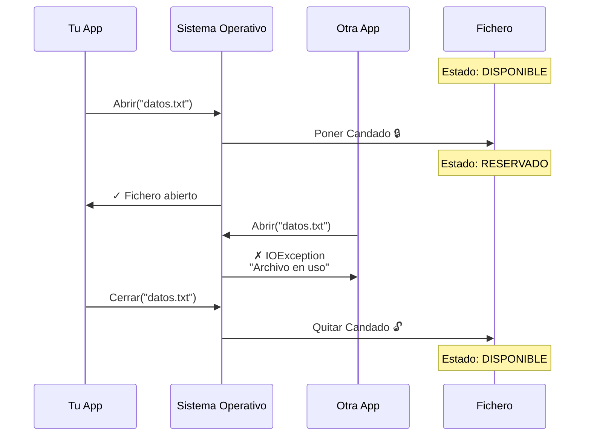
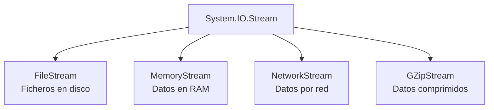
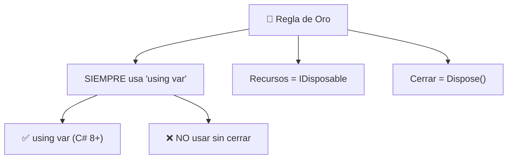

- [1. Fundamentos de I/O y Streams](#1-fundamentos-de-io-y-streams)
  - [1.1. El Problema Fundamental: ¿Por qué cerrar los recursos?](#11-el-problema-fundamental-por-qué-cerrar-los-recursos)
    - [1.1.1. ¿Qué son los Recursos?](#111-qué-son-los-recursos)
    - [1.1.2. El Sistema de Candados del Sistema Operativo](#112-el-sistema-de-candados-del-sistema-operativo)
    - [1.1.3. ¿Qué pasa si no cerramos los recursos?](#113-qué-pasa-si-no-cerramos-los-recursos)
  - [1.2. La Interfaz IDisposable: El Contrato de Limpieza](#12-la-interfaz-idisposable-el-contrato-de-limpieza)
  - [1.3. La Revolución del `using`: Liberación Automática](#13-la-revolución-del-using-liberación-automática)
    - [1.3.1. Bloque `using` Clásico](#131-bloque-using-clásico)
    - [1.3.2. Declaración `using var` (C# 8+) - **FORMA MODERNA**](#132-declaración-using-var-c-8---forma-moderna)
    - [1.3.3. ¿Cuándo Usar Cada Uno?](#133-cuándo-usar-cada-uno)
    - [1.3.4. Ejemplo Comparativo: Forma Antigua vs Forma Moderna](#134-ejemplo-comparativo-forma-antigua-vs-forma-moderna)
  - [1.4. ¿Qué es un Flujo (Stream)?](#14-qué-es-un-flujo-stream)
    - [1.4.1. El Problema: Los Ficheros son Grandes](#141-el-problema-los-ficheros-son-grandes)
    - [1.4.2. ¿Por Qué Usar Streams?](#142-por-qué-usar-streams)
    - [1.4.3. Operaciones Básicas de un Stream](#143-operaciones-básicas-de-un-stream)
    - [1.4.4. Tipos de Streams: La Jerarquía](#144-tipos-de-streams-la-jerarquía)
    - [1.4.5. Decoradores: StreamReader y StreamWriter](#145-decoradores-streamreader-y-streamwriter)
  - [1.5. ¿Qué es un Fichero?](#15-qué-es-un-fichero)
    - [1.5.1. Definición: Fichero y Directorio](#151-definición-fichero-y-directorio)
    - [1.5.2. Anatomía de un Fichero: Metadatos vs Contenido](#152-anatomía-de-un-fichero-metadatos-vs-contenido)
    - [1.5.3. La Jerarquía del Sistema de Ficheros](#153-la-jerarquía-del-sistema-de-ficheros)
  - [1.6. Ejemplo Completo: Demostración del Sistema de Candados](#16-ejemplo-completo-demostración-del-sistema-de-candados)
  - [1.7. Resumen de Buenas Prácticas](#17-resumen-de-buenas-prácticas)

# 1. Fundamentos de I/O y Streams

Antes de escribir una sola línea de código que maneje ficheros, necesitamos entender **qué son los recursos del sistema operativo** y **por qué es fundamental cerrarlos correctamente**. Este es el concepto más importante de toda la unidad.

> 📝 **Nota del Profesor**: Esta sección es ABSOLUTAMENTE FUNDAMENTAL. Si no entiendes por qué se usa `using` y qué son los recursos, tu aplicación tendrá fugas de memoria y recursos que la bloquearán. Es el error más común en programadores junior.

---

## 1.1. El Problema Fundamental: ¿Por qué cerrar los recursos?

### 1.1.1. ¿Qué son los Recursos?

Los **recursos** son elementos del sistema operativo que tu programa **reserva** para funcionar. Cuando abres un fichero, una conexión de red, o una base de datos, estás reservando un recurso.

**🧠 Analogía: La Reserva de un Libro en la Biblioteca**

Imagina que vas a una biblioteca:
1. **Reservas un libro** (abres el fichero) → El bibliotecario pone una marca
2. **Lo lees** (trabajas con el fichero)
3. **Devuelves el libro** (cierras el fichero) → La marca se quita

**¿Qué pasa si te olvidas de devolver el libro?**
- El libro queda **bloqueado** para otros usuarios
- La biblioteca deja de funcionar porque no puede prestar ese libro
- Si muchos hacen esto, la biblioteca colapsa

**En programación ocurre exactamente igual con los recursos:**

| Recurso | Ejemplo de Reserva | Qué pasa si no se devuelve |
|---------|-------------------|---------------------------|
| Fichero en disco | `File.Open("datos.txt")` | Fichero bloqueado para siempre |
| Conexión a red | `HttpClient.Get()` | Agotamiento de sockets |
| Conexión a BD | `SqlConnection.Open()` | BD saturada de conexiones |
| Memoria | `new Bitmap()` | Memory leak |

### 1.1.2. El Sistema de Candados del Sistema Operativo

Cuando tu programa **abre un fichero**, el sistema operativo coloca un **"candado"** (lock) en él:



### 1.1.3. ¿Qué pasa si no cerramos los recursos?

**Código problemático (NUNCA hacer esto):**

```csharp
// ❌ CÓDIGO MUY PROBLEMÁTICO

var file = File.Open("datos.txt", FileMode.Open);

// ... trabajar con el archivo ...

// ¡OLVIDO CERRAR EL ARCHIVO!
// file.Close(); // ← Esta línea falta

// CONSECUENCIA: El candado nunca se libera
// Nadie más puede abrir este archivo
```

**Peor aún: Si hay una excepción, el código nunca se ejecuta:**

```csharp
// ❌ NUNCA HAGAS ESTO

FileStream file = File.Open("datos.txt", FileMode.Open);

byte[] buffer = new byte[100];
file.Read(buffer, 0, buffer.Length);

// ¡Aquí ocurre una excepción!
int resultado = 10 / 0; // ← BOOM! Excepción

file.Close(); // ← Esta línea NUNCA se ejecuta

// RESULTADO: Fichero bloqueado PARA SIEMPRE
// Hasta reiniciar el equipo o matar el proceso
```

---

## 1.2. La Interfaz IDisposable: El Contrato de Limpieza

Para resolver este problema, .NET creó la interfaz `IDisposable`. Es un **contrato** que dice:

> "Esta clase maneja recursos que DEBEN liberarse manualmente. Llama a `Dispose()` cuando termines."

```csharp
public interface IDisposable
{
    void Dispose(); // Método que libera el recurso
}
```

**Clases que implementan IDisposable:**

| Clase | Recurso que Gestiona | Por qué necesita Dispose |
|-------|---------------------|------------------------|
| `FileStream` | Fichero en disco | Liberar candado del SO |
| `StreamReader` | Lector de texto | Cerrar stream subyacente |
| `StreamWriter` | Escritor de texto | Volcar buffer + cerrar stream |
| `SqlConnection` | Conexión a BD | Cerrar conexión de red |
| `HttpClient` | Cliente HTTP | Cerrar sockets de red |
| `Bitmap` | Imagen en memoria | Liberar memoria nativa |

**Cómo se usaba antes (forma antigua y verbosa):**

```csharp
// Forma antigua: try-finally manual
FileStream file = File.Open("datos.txt", FileMode.Open);

try
{
    // Trabajar con el archivo
    byte[] buffer = new byte[100];
    file.Read(buffer, 0, buffer.Length);
}
finally
{
    // SIEMPRE se ejecuta, incluso con excepciones
    file.Dispose(); // O file.Close()
}
```

---

## 1.3. La Revolución del `using`: Liberación Automática

C# introdujo la palabra clave `using` para **automatizar** la llamada a `Dispose()`, garantizando que el recurso se libere **incluso si hay excepciones**.

### 1.3.1. Bloque `using` Clásico

```csharp
// BLOQUE USING CLÁSICO (C# 1.0) - Forma Antigua
using (var reader = new StreamReader("datos.txt"))
{
    string contenido = reader.ReadToEnd();
    Console.WriteLine(contenido);
} // ← Se cierra aquí automáticamente

Console.WriteLine("Fichero cerrado");
```

**El compilador traduce esto a:**

```csharp
StreamReader reader = new StreamReader("datos.txt");

try
{
    string contenido = reader.ReadToEnd();
    Console.WriteLine(contenido);
}
finally
{
    if (reader != null)
    {
        reader.Dispose(); // ¡SIEMPRE se ejecuta!
    }
}
```

### 1.3.2. Declaración `using var` (C# 8+) - **FORMA MODERNA**

> 💡 **Tip del Examinador**: Esta es la forma RECOMENDADA en C# moderno. Úsala siempre que puedas.

C# 8 introdujo una sintaxis **más limpia**: `using` sin llaves. El recurso se libera automáticamente **al final del ámbito**.

```csharp
// FORMA MODERNA: using var (C# 8+) - RECOMENDADA
using var reader = new StreamReader("datos.txt");

// Trabajar con el archivo (sin llaves)
string contenido = reader.ReadToEnd();
Console.WriteLine(contenido);

// Al final del método/bloque, reader.Dispose() se llama automáticamente
Console.WriteLine("Fichero cerrado");
```

> 📝 **Nota Importante**: Aunque `using var` no muestra llaves, el compilador las añade automáticamente al final del método o bloque donde se declare. Es como si el compilador transformara:
> ```csharp
> using var reader = new StreamReader("datos.txt");
> // código...
> // fin del método/bloque → se cierra aquí
> ```
> en:
> ```csharp
> using (var reader = new StreamReader("datos.txt"))
> {
>     // código...
> } // ← se cierra aquí
> ```

**Ventajas de `using var`:**

✅ **Menos indentación** (código más plano)  
✅ **Más legible** con múltiples recursos  
✅ **Scope claro** (fin del método/bloque)  
✅ **Estilo moderno** de C# 8+ / .NET Core 3.0+  

### 1.3.3. ¿Cuándo Usar Cada Uno?

| Situación | Usar | Razón |
|----------|------|-------|
| **Código simple, recurso hasta el final** | `using var` | Más limpio |
| **Control preciso del cierre** | Bloque `using { }` | Cerrar antes del fin |
| **Múltiples recursos independientes** | Varios `using var` | Sin anidamiento |
| **Recursos dependientes** | Bloque `using` anidado | Control de orden |

### 1.3.4. Ejemplo Comparativo: Forma Antigua vs Forma Moderna

**🆚 ANTES (Forma Antigua con llaves):**

```csharp
using (var ms = new MemoryStream())
{
    byte[] datos = Encoding.UTF8.GetBytes("Hola desde MemoryStream");
    ms.Write(datos, 0, datos.Length);
} // ← Se cierra aquí
```

**🆚 AHORA (Forma Moderna con `using var`):**

```csharp
using var ms = new MemoryStream();

for (int i = 0; i < 10000; i++)
{
    byte[] data = BitConverter.GetBytes(i);
    ms.Write(data, 0, data.Length);
}
// ← Se cierra al final del método
```

**Comparación completa con FileStream:**

```csharp
// FORMA ANTIGUA (con llaves y paréntesis)
using (var fileStream = new FileStream("test.txt", FileMode.Create))
{
    byte[] datos = Encoding.UTF8.GetBytes("Hola desde FileStream");
    fileStream.Write(datos, 0, datos.Length);
}

// FORMA MODERNA (using var) - RECOMENDADA
using var fileStream = new FileStream("test.txt", FileMode.Create);

byte[] datos = Encoding.UTF8.GetBytes("Hola desde FileStream");
fileStream.Write(datos, 0, datos.Length);
Console.WriteLine($"  ✓ Escrito {datos.Length} bytes en disco");
```

---

## 1.4. ¿Qué es un Flujo (Stream)?

Un **Stream** (flujo) es una **abstracción** que representa una secuencia de datos que se procesa **poco a poco**, en lugar de todo a la vez.

### 1.4.1. El Problema: Los Ficheros son Grandes

Imagina un fichero de **1 GB** (un vídeo). Cargar todo en RAM consumiría toda la memoria.

**🧠 Analogía: El Río**

```
Origen (fichero)          Destino (programa)
     │                         │
     │  ┌──────┐              │
┌────┴──┤ AGUA ├────────────┴────┐
│       └──────┘                    │
│    ← ← ← ← ← ← ← ← ← ←          │
│         Flujo continuo            │
└───────────────────────────────────┘

No necesitas todo el río a la vez,
solo el agua que pasa en cada momento.
```

### 1.4.2. ¿Por Qué Usar Streams?

1. **Eficiencia de memoria**: Procesas pequeños trozos
2. **Velocidad**: Empiezas a procesar ANTES de cargar todo
3. **Ficheros grandes**: GB sin problemas
4. **Universalidad**: Misma API para ficheros, red, memoria

```csharp
// ❌ SIN Stream: Todo a memoria (peligroso)
byte[] todosLosBytes = File.ReadAllBytes("video.mp4"); // 1 GB en RAM

// ✅ CON Stream: Procesar por partes
using var stream = File.OpenRead("video.mp4");
byte[] buffer = new byte[4096]; // Buffer de 4 KB

while (stream.Read(buffer, 0, buffer.Length) > 0)
{
    // Procesar solo estos 4 KB
}
```

### 1.4.3. Operaciones Básicas de un Stream

| Operación | Descripción | Método |
|-----------|-------------|--------|
| **Abrir** | Conectar con la fuente | Constructor |
| **Leer** | Obtener datos | `Read()` |
| **Escribir** | Enviar datos | `Write()` |
| **Buscar** | Mover posición | `Seek()` |
| **Cerrar** | Liberar recurso | `Dispose()` |

### 1.4.4. Tipos de Streams: La Jerarquía



**Ejemplo con `using var`:**

```csharp
using var memStream = new MemoryStream();

byte[] datos = Encoding.UTF8.GetBytes("Hola desde MemoryStream");
memStream.Write(datos, 0, datos.Length);

Console.WriteLine($"  ✓ Escrito {datos.Length} bytes en RAM");
```

### 1.4.5. Decoradores: StreamReader y StreamWriter

Los Streams trabajan con **bytes**, pero nosotros queremos **texto**. Existen los decoradores:

```csharp
// Forma moderna recomendada
using var writer = new StreamWriter("datos.txt");
writer.WriteLine("Esta es una línea");
writer.WriteLine("Y esta es otra");
```

---

## 1.5. ¿Qué es un Fichero?

Un **fichero** es una secuencia de bytes almacenada en un dispositivo persistente, identificada por un nombre único.

### 1.5.1. Definición: Fichero y Directorio

```
┌─────────────────────────────────────┐
│  FICHERO = Nombre + Bytes          │
├─────────────────────────────────────┤
│  Nombre:    "documento.txt"        │
│  Bytes:    [72][111][108][97]...   │
└─────────────────────────────────────┘
```

**Un directorio** es un contenedor que almacena ficheros y otros directorios (como una estantería de biblioteca).

### 1.5.2. Anatomía de un Fichero: Metadatos vs Contenido

**Metadatos** (información SOBRE el fichero):
- Nombre, tamaño, fechas, permisos

**Contenido** (los bytes reales):
- La información almacenada

### 1.5.3. La Jerarquía del Sistema de Ficheros

```
C:\
│
├─ Users\
│  └─ Alumno\
│     ├─ Documents\
│     └─ Pictures\
│
└─ Program Files\
```

**Rutas:**

```csharp
// Absoluta: desde raíz
string absoluta = @"C:\Users\Alumno\documento.txt";

// Relativa: desde directorio actual
string relativa = "documento.txt";
```

---

## 1.6. Ejemplo Completo: Demostración del Sistema de Candados

```csharp
using System;
using System.IO;

Console.WriteLine("═══════════════════════════════════════════");
Console.WriteLine("  DEMOSTRACIÓN: Sistema de Candados");
Console.WriteLine("═══════════════════════════════════════════\n");

string archivoTest = "candado_test.txt";

// ✅ FORMA MODERNA: usando using var
using var writer = new StreamWriter(archivoTest);
writer.WriteLine("Línea 1");
writer.WriteLine("Línea 2");
Console.WriteLine("✓ Archivo creado y escrito");
Console.WriteLine("✓ Archivo cerrado automáticamente\n");

// Demostrar problema del candado
Console.WriteLine(">>> Demostrar el problema del candado:");

FileStream? file1 = null;

try
{
    file1 = File.Open(archivoTest, FileMode.Open, FileAccess.Read);
    Console.WriteLine("✓ Primera apertura: OK");
    
    var file2 = File.Open(archivoTest, FileMode.Open, FileAccess.Write);
}
catch (IOException ex)
{
    Console.WriteLine($"✗ ERROR: {ex.Message}");
    Console.WriteLine("→ El archivo está bloqueado\n");
}
finally
{
    file1?.Dispose();
}

// ✅ Solución correcta con using var
using var file1Read = File.Open(archivoTest, FileMode.Open, FileAccess.Read);
Console.WriteLine("✓ Primera apertura: OK");

using var file2Write = File.Open(archivoTest, FileMode.Append, FileAccess.Write);
using var writer2 = new StreamWriter(file2Write);
writer2.WriteLine("Línea 3 (añadida)");
Console.WriteLine("✓ Segunda apertura: OK\n");

File.Delete(archivoTest);

Console.WriteLine("═══════════════════════════════════════════");
```

---

## 1.7. Resumen de Buenas Prácticas



| Práctica | ✅ Correcto | ❌ Incorrecto |
|----------|------------|---------------|
| Cerrar recursos | `using var reader = ...` | `var reader = ...` sin cerrar |
| Ficheros grandes | Stream con buffer | `File.ReadAllBytes()` |
| Múltiples recursos | Varios `using var` | Anidar muchos `using { }` |
| Excepciones | `using` las maneja | `try { } finally { }` manual |

> 📝 **Nota del Profesor**: Si te llevas UNA sola cosa de esta lección: **SIEMPRE usa `using var`**. Es la regla de oro que evitará que tu aplicación se bloquee por falta de recursos.

> 💡 **Tip del Examinador**: En el examen pueden preguntar "¿qué pasa si no usamos using?" La respuesta: el recurso queda bloqueado (locked) hasta que el garbage collector lo reclame o se cierre la aplicación.
