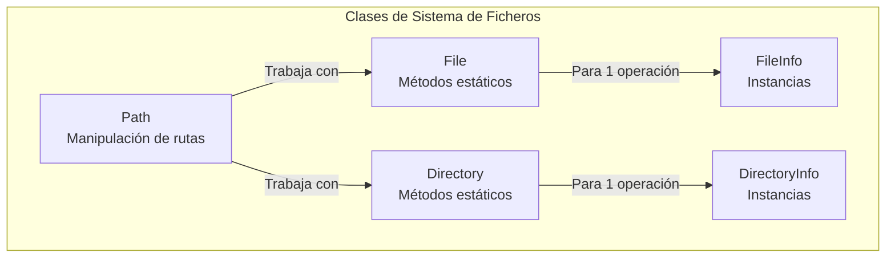
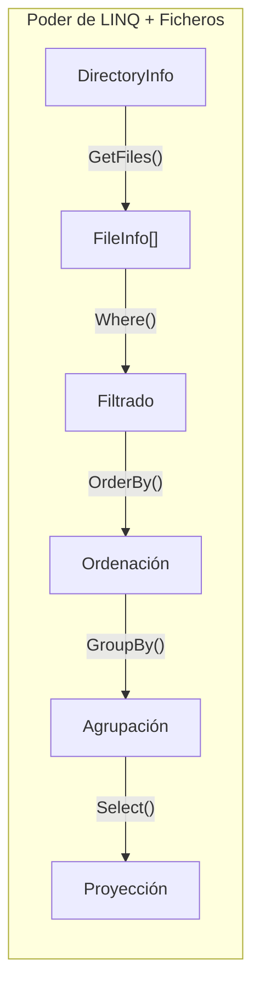

- [2. Manipulación del Sistema de Ficheros](#2-manipulación-del-sistema-de-ficheros)
  - [2.1. Las Herramientas del Sistema de Archivos](#21-las-herramientas-del-sistema-de-archivos)
  - [2.2. La Clase `File`: Operaciones sobre Ficheros](#22-la-clase-file-operaciones-sobre-ficheros)
    - [2.2.1. Verificar Existencia](#221-verificar-existencia)
    - [2.2.2. Crear y Escribir](#222-crear-y-escribir)
    - [2.2.3. Leer Contenido](#223-leer-contenido)
    - [2.2.4. Copiar Ficheros](#224-copiar-ficheros)
    - [2.2.5. Mover Ficheros](#225-mover-ficheros)
    - [2.2.6. Eliminar Ficheros](#226-eliminar-ficheros)
    - [2.2.7. Obtener Información: Metadatos](#227-obtener-información-metadatos)
  - [2.3. La Clase `FileInfo`: Operaciones Orientadas a Objetos](#23-la-clase-fileinfo-operaciones-orientadas-a-objetos)
    - [2.3.1. Diferencia entre `File` y `FileInfo`](#231-diferencia-entre-file-y-fileinfo)
    - [2.3.2. Ejemplo Completo con FileInfo](#232-ejemplo-completo-con-fileinfo)
  - [2.4. La Clase `Directory`: Operaciones sobre Directorios](#24-la-clase-directory-operaciones-sobre-directorios)
    - [2.4.1. Crear Directorios](#241-crear-directorios)
    - [2.4.2. Listar Contenido](#242-listar-contenido)
    - [2.4.3. Búsqueda con Patrones](#243-búsqueda-con-patrones)
    - [2.4.4. Búsqueda Recursiva](#244-búsqueda-recursiva)
    - [2.4.5. Mover y Eliminar Directorios](#245-mover-y-eliminar-directorios)
  - [2.5. La Clase `Path`: Manipulación de Rutas](#25-la-clase-path-manipulación-de-rutas)
    - [2.5.1. Combinar Rutas](#251-combinar-rutas)
    - [2.5.2. Extraer Componentes de una Ruta](#252-extraer-componentes-de-una-ruta)
    - [2.5.3. Generar Rutas Temporales](#253-generar-rutas-temporales)
    - [2.5.4. Rutas Absolutas vs Relativas](#254-rutas-absolutas-vs-relativas)
  - [2.6. LINQ + Sistema de Ficheros: Búsquedas Avanzadas](#26-linq--sistema-de-ficheros-búsquedas-avanzadas)
    - [2.6.1. Filtrar Ficheros por Tamaño](#261-filtrar-ficheros-por-tamaño)
    - [2.6.2. Filtrar por Fecha de Modificación](#262-filtrar-por-fecha-de-modificación)
    - [2.6.3. Búsqueda Compleja: Imágenes JPG Grandes](#263-búsqueda-compleja-imágenes-jpg-grandes)
    - [2.6.4. Agrupar Ficheros por Extensión](#264-agrupar-ficheros-por-extensión)

# 2. Manipulación del Sistema de Ficheros

Hasta ahora hemos aprendido a **abrir** y **trabajar con el contenido** de ficheros mediante streams. Pero antes de leer o escribir, necesitamos:

- **Verificar** si un fichero existe
- **Crear** directorios
- **Copiar** o **mover** ficheros
- **Eliminar** ficheros temporales
- **Obtener información** (tamaño, fechas, permisos)

> 📝 **Nota del Profesor**: Estas clases son las herramientas básicas que usarás en prácticamente cualquier aplicación que maneje ficheros. Domínalas bien porque son el fundamento de cualquier operación de entrada/salida.

## 2.1. Las Herramientas del Sistema de Archivos

.NET proporciona tres clases principales para estas operaciones:

| Clase       | Propósito                           | Tipo de Métodos                               |
| ----------- | ----------------------------------- | --------------------------------------------- |
| `File`      | Operaciones sobre **ficheros**      | Estáticos (ej: `File.Exists()`)               |
| `Directory` | Operaciones sobre **directorios**   | Estáticos (ej: `Directory.CreateDirectory()`) |
| `Path`      | Manipulación de **rutas** (strings) | Estáticos (ej: `Path.Combine()`)              |

Además, tenemos clases para operaciones más avanzadas:

| Clase           | Propósito                              | Cuándo Usar                                     |
| --------------- | -------------------------------------- | ----------------------------------------------- |
| `FileInfo`      | Información detallada de un fichero    | Múltiples operaciones sobre el mismo fichero     |
| `DirectoryInfo` | Información detallada de un directorio | Múltiples operaciones sobre el mismo directorio |



## 2.2. La Clase `File`: Operaciones sobre Ficheros

La clase `File` proporciona métodos **estáticos** para trabajar con ficheros. No necesitas crear instancias, solo llamar a los métodos directamente.

### 2.2.1. Verificar Existencia

```csharp
using System;
using System.IO;

string rutaFichero = "documento.txt";

if (File.Exists(rutaFichero))
{
    Console.WriteLine($"✓ El fichero '{rutaFichero}' existe");
}
else
{
    Console.WriteLine($"✗ El fichero '{rutaFichero}' NO existe");
}
```

**¿Por qué es importante verificar antes de abrir?**

```csharp
// ❌ SIN verificar (puede lanzar excepción)
try
{
    using var reader = new StreamReader("noexiste.txt");
}
catch (FileNotFoundException ex)
{
    Console.WriteLine($"Error: {ex.Message}");
}

// ✓ CON verificación (más elegante)
if (File.Exists("noexiste.txt"))
{
    using var reader = new StreamReader("noexiste.txt");
    // Procesar... 
}
else
{
    Console.WriteLine("El fichero no existe. Creando uno nuevo...");
    File.WriteAllText("noexiste.txt", "Contenido inicial");
}
```

### 2.2.2. Crear y Escribir

```csharp
// CREAR FICHERO Y ESCRIBIR CONTENIDO

// Método 1: WriteAllText (todo el contenido de una vez)
string contenido = "Esta es la línea 1\nEsta es la línea 2\nEsta es la línea 3";
File.WriteAllText("fichero1.txt", contenido);
Console.WriteLine("✓ Fichero creado con WriteAllText");

// Método 2: WriteAllLines (array de líneas)
string[] lineas = 
[
    "Primera línea",
    "Segunda línea",
    "Tercera línea"
];
File.WriteAllLines("fichero2.txt", lineas);
Console.WriteLine("✓ Fichero creado con WriteAllLines");

// Método 3: WriteAllBytes (array de bytes)
byte[] bytes = { 72, 111, 108, 97 }; // "Hola" en UTF-8
File.WriteAllBytes("fichero3.bin", bytes);
Console.WriteLine("✓ Fichero binario creado con WriteAllBytes");
```

> ⚠️ **Advertencia**: Estos métodos SOBRESCRIBEN el fichero si ya existe.

```csharp
// Si el fichero existe, se BORRA y se crea uno nuevo
File.WriteAllText("importante.txt", "Contenido original");
File.WriteAllText("importante.txt", "Nuevo contenido"); // ← ¡Se pierde el original!
```

### 2.2.3. Leer Contenido

```csharp
// LEER CONTENIDO DE UN FICHERO

// Método 1: ReadAllText (todo el contenido como string)
if (File.Exists("fichero1.txt"))
{
    string contenido = File.ReadAllText("fichero1.txt");
    Console.WriteLine($"Contenido completo:\n{contenido}");
}

// Método 2: ReadAllLines (array de líneas)
if (File.Exists("fichero2.txt"))
{
    string[] lineas = File.ReadAllLines("fichero2.txt");
    Console.WriteLine($"\nTotal de líneas: {lineas.Length}");
    
    for (int i = 0; i < lineas.Length; i++)
    {
        Console.WriteLine($"  Línea {i + 1}: {lineas[i]}");
    }
}

// Método 3: ReadAllBytes (array de bytes)
if (File.Exists("fichero3.bin"))
{
    byte[] bytes = File.ReadAllBytes("fichero3.bin");
    Console.WriteLine($"\nBytes leídos: [{string.Join(", ", bytes)}]");
}
```

> ⚠️ **Advertencia**: No uses estos métodos con ficheros grandes (> 100 MB).

```csharp
// ❌ MAL: Fichero de 2 GB cargado completamente en RAM
string contenido = File.ReadAllText("video.mp4"); // ¡OutOfMemoryException!

// ✓ BIEN: Usar streams para ficheros grandes
using var stream = File.OpenRead("video.mp4");
byte[] buffer = new byte[4096];
while (stream.Read(buffer, 0, buffer.Length) > 0)
{
    // Procesar solo 4 KB cada vez
}
```

### 2.2.4. Copiar Ficheros

```csharp
// COPIAR FICHEROS

string origen = "original.txt";
string destino = "copia.txt";

// Crear fichero de origen
File.WriteAllText(origen, "Contenido del fichero original");

// Copiar (lanza excepción si el destino ya existe)
try
{
    File.Copy(origen, destino);
    Console.WriteLine($"✓ Fichero copiado:  {origen} → {destino}");
}
catch (IOException ex)
{
    Console.WriteLine($"✗ Error al copiar: {ex.Message}");
}

// Copiar SOBRESCRIBIENDO si ya existe
File.Copy(origen, destino, overwrite: true);
Console.WriteLine("✓ Fichero copiado (sobrescrito si existía)");
```

### 2.2.5. Mover Ficheros

```csharp
// MOVER / RENOMBRAR FICHEROS

string rutaActual = "fichero_viejo.txt";
string rutaNueva = "fichero_nuevo.txt";

File.WriteAllText(rutaActual, "Contenido");

// Mover/Renombrar (el origen desaparece)
File.Move(rutaActual, rutaNueva);
Console.WriteLine($"✓ Fichero movido: {rutaActual} → {rutaNueva}");

// Verificar
Console.WriteLine($"¿Existe '{rutaActual}'? {File.Exists(rutaActual)}"); // false
Console.WriteLine($"¿Existe '{rutaNueva}'? {File.Exists(rutaNueva)}");   // true

// Mover a otro directorio
Directory.CreateDirectory("backup");
File.Move(rutaNueva, Path.Combine("backup", rutaNueva));
Console.WriteLine($"✓ Fichero movido a:  backup/{rutaNueva}");
```

**Diferencia entre `Copy` y `Move`:**

```
COPY:  Origen se mantiene, destino se crea
[origen.txt] ──Copy──→ [origen.txt]  +  [destino.txt]

MOVE: Origen desaparece, destino se crea
[origen.txt] ──Move──→ [destino.txt]
```

### 2.2.6. Eliminar Ficheros

```csharp
// ELIMINAR FICHEROS

string ficheroEliminar = "temporal.txt";

File.WriteAllText(ficheroEliminar, "Contenido temporal");

if (File.Exists(ficheroEliminar))
{
    File.Delete(ficheroEliminar);
    Console.WriteLine($"✓ Fichero eliminado: {ficheroEliminar}");
}

// Delete NO lanza excepción si el fichero no existe
File.Delete("noexiste.txt"); // No hace nada, no lanza error
Console.WriteLine("✓ Delete es seguro aunque el fichero no exista");
```

### 2.2.7. Obtener Información: Metadatos

```csharp
// OBTENER INFORMACIÓN DE UN FICHERO

string rutaInfo = "info_test.txt";
File.WriteAllText(rutaInfo, "Contenido de prueba para obtener información.");

if (File.Exists(rutaInfo))
{
    Console.WriteLine($"\n═══ INFORMACIÓN DE '{rutaInfo}' ═══");
    
    // Fechas
    DateTime creacion = File.GetCreationTime(rutaInfo);
    DateTime modificacion = File.GetLastWriteTime(rutaInfo);
    DateTime acceso = File.GetLastAccessTime(rutaInfo);
    
    Console.WriteLine($"Fecha de creación:       {creacion}");
    Console.WriteLine($"Última modificación:    {modificacion}");
    Console.WriteLine($"Último acceso:          {acceso}");
    
    // Atributos
    FileAttributes atributos = File.GetAttributes(rutaInfo);
    Console.WriteLine($"Atributos:               {atributos}");
    
    // Tamaño (requiere FileInfo)
    var fileInfo = new FileInfo(rutaInfo);
    Console.WriteLine($"Tamaño:                 {fileInfo.Length} bytes");
}

// Limpiar
File.Delete(rutaInfo);
```

## 2.3. La Clase `FileInfo`: Operaciones Orientadas a Objetos

Cuando necesitas realizar **múltiples operaciones** sobre el **mismo fichero**, usar `FileInfo` es más eficiente que usar `File`.

### 2.3.1. Diferencia entre `File` y `FileInfo`

| Aspecto     | `File` (estático)        | `FileInfo` (instancia)        |
| ----------- | ------------------------ | ----------------------------- |
| Sintaxis    | `File.Exists("ruta")`   | `new FileInfo("ruta").Exists` |
| Rendimiento | Verifica en cada llamada | Cachea información            |
| Uso típico  | Una operación puntual    | Múltiples operaciones         |

```csharp
// COMPARACIÓN:   File vs FileInfo

string ruta = "ejemplo.txt";
File.WriteAllText(ruta, "Contenido de ejemplo");

// Opción 1: File (múltiples verificaciones)
if (File.Exists(ruta))
{
    long tamaño = new FileInfo(ruta).Length; // Acceso a disco
    DateTime fecha = File.GetLastWriteTime(ruta); // Acceso a disco
    FileAttributes attr = File.GetAttributes(ruta); // Acceso a disco
    
    Console.WriteLine($"Tamaño: {tamaño} bytes");
}

// Opción 2: FileInfo (una verificación, caché)
var fileInfo = new FileInfo(ruta);

if (fileInfo.Exists)
{
    long tamaño = fileInfo.Length;               // Desde caché
    DateTime fecha = fileInfo.LastWriteTime;     // Desde caché
    FileAttributes attr = fileInfo.Attributes; // Desde caché
    
    Console.WriteLine($"Tamaño: {tamaño} bytes");
}

File.Delete(ruta);
```

> 💡 **Tip del Examinador**: Si vas a hacer más de una operación sobre el mismo fichero, usa `FileInfo`. Reduces el acceso a disco y el código es más limpio.

### 2.3.2. Ejemplo Completo con FileInfo

```csharp
using System;
using System.IO;

string rutaArchivo = "documento_completo.txt";

// Crear fichero de prueba
File.WriteAllText(rutaArchivo, "Este es un documento de ejemplo.\nSegunda línea.");

// Crear instancia de FileInfo
var fileInfo = new FileInfo(rutaArchivo);

Console.WriteLine("═══════════════════════════════════════════");
Console.WriteLine("  INFORMACIÓN COMPLETA DEL FICHERO");
Console.WriteLine("═══════════════════════════════════════════\n");

// PROPIEDADES BÁSICAS
Console.WriteLine(">>> PROPIEDADES BÁSICAS");
Console.WriteLine($"Nombre:               {fileInfo.Name}");
Console.WriteLine($"Nombre sin extensión: {Path.GetFileNameWithoutExtension(fileInfo.Name)}");
Console.WriteLine($"Extensión:           {fileInfo.Extension}");
Console.WriteLine($"Ruta completa:       {fileInfo.FullName}");
Console.WriteLine($"Directorio:          {fileInfo.DirectoryName}");

// TAMAÑO Y FECHAS
Console.WriteLine("\n>>> TAMAÑO Y FECHAS");
Console.WriteLine($"Tamaño:              {fileInfo.Length} bytes");
Console.WriteLine($"Creado:              {fileInfo.CreationTime: dd/MM/yyyy HH:mm:ss}");
Console.WriteLine($"Modificado:          {fileInfo.LastWriteTime:dd/MM/yyyy HH:mm:ss}");
Console.WriteLine($"Último acceso:       {fileInfo.LastAccessTime:dd/MM/yyyy HH:mm:ss}");

// ATRIBUTOS
Console.WriteLine("\n>>> ATRIBUTOS");
Console.WriteLine($"¿Es solo lectura?    {fileInfo.IsReadOnly}");
Console.WriteLine($"Atributos completos: {fileInfo.Attributes}");

// Verificar atributos específicos
bool esOculto = (fileInfo.Attributes & FileAttributes.Hidden) == FileAttributes.Hidden;
bool esSistema = (fileInfo.Attributes & FileAttributes.System) == FileAttributes.System;

Console.WriteLine($"¿Es oculto?          {esOculto}");
Console.WriteLine($"¿Es de sistema?      {esSistema}");

// OPERACIONES
Console.WriteLine("\n>>> OPERACIONES");

// Copiar
var copia = fileInfo.CopyTo("copia_documento.txt", overwrite: true);
Console.WriteLine($"✓ Copiado a:          {copia.FullName}");

// Mover
fileInfo.MoveTo("documento_movido.txt");
Console.WriteLine($"✓ Movido a:          {fileInfo.FullName}");

// Abrir para lectura
using var stream = fileInfo.OpenRead();

using var reader = new StreamReader(stream);
string primeraLinea = reader.ReadLine() ?? "";
Console.WriteLine($"Primera línea:        {primeraLinea}");

// Eliminar
fileInfo.Delete();
Console.WriteLine($"✓ Fichero eliminado");

// Limpiar copia
File.Delete("copia_documento.txt");

Console.WriteLine("\n═══════════════════════════════════════════");
```

## 2.4. La Clase `Directory`: Operaciones sobre Directorios

La clase `Directory` proporciona métodos estáticos para trabajar con directorios (carpetas).

### 2.4.1. Crear Directorios

```csharp
// CREAR DIRECTORIOS

string rutaDirectorio = "MiCarpeta";

// Crear directorio
if (!Directory.Exists(rutaDirectorio))
{
    Directory.CreateDirectory(rutaDirectorio);
    Console.WriteLine($"✓ Directorio creado:  {rutaDirectorio}");
}
else
{
    Console.WriteLine($"El directorio '{rutaDirectorio}' ya existe");
}

// Crear estructura de directorios anidados
string rutaAnidada = Path.Combine("Proyecto", "src", "models");
Directory.CreateDirectory(rutaAnidada);
Console.WriteLine($"✓ Estructura creada: {rutaAnidada}");
// Crea automáticamente:  Proyecto/src/models
```

> 📝 **Nota del Profesor**: `CreateDirectory` es **idempotente** (no lanza error si ya existe). Es seguro llamarlo múltiples veces.

### 2.4.2. Listar Contenido

```csharp
// LISTAR CONTENIDO DE UN DIRECTORIO

string carpetaPrueba = "TestListado";
Directory.CreateDirectory(carpetaPrueba);

// Crear ficheros de prueba
File.WriteAllText(Path.Combine(carpetaPrueba, "doc1.txt"), "Contenido 1");
File.WriteAllText(Path.Combine(carpetaPrueba, "doc2.txt"), "Contenido 2");
File.WriteAllText(Path.Combine(carpetaPrueba, "imagen.jpg"), "fake image");

// Crear subdirectorio
Directory.CreateDirectory(Path.Combine(carpetaPrueba, "Subfolder"));

// Listar FICHEROS
Console.WriteLine($"\n>>> FICHEROS EN '{carpetaPrueba}':");
string[] ficheros = Directory.GetFiles(carpetaPrueba);

foreach (string fichero in ficheros)
{
    var info = new FileInfo(fichero);
    Console.WriteLine($"  📄 {info.Name} ({info.Length} bytes)");
}

// Listar DIRECTORIOS
Console.WriteLine($"\n>>> DIRECTORIOS EN '{carpetaPrueba}':");
string[] directorios = Directory.GetDirectories(carpetaPrueba);

foreach (string directorio in directorios)
{
    var info = new DirectoryInfo(directorio);
    Console.WriteLine($"  📁 {info.Name}");
}

// Listar TODO (ficheros + directorios)
Console.WriteLine($"\n>>> TODO EN '{carpetaPrueba}':");
string[] todo = Directory.GetFileSystemEntries(carpetaPrueba);

foreach (string entrada in todo)
{
    string icono = Directory.Exists(entrada) ? "📁" : "📄";
    Console.WriteLine($"  {icono} {Path.GetFileName(entrada)}");
}
```

### 2.4.3. Búsqueda con Patrones

```csharp
// BÚSQUEDA CON PATRONES (wildcards)

// Crear ficheros de diferentes tipos
Directory.CreateDirectory("Documentos");
File.WriteAllText(Path.Combine("Documentos", "reporte.pdf"), "PDF content");
File.WriteAllText(Path.Combine("Documentos", "informe.docx"), "Word content");
File.WriteAllText(Path.Combine("Documentos", "datos.xlsx"), "Excel content");
File.WriteAllText(Path.Combine("Documentos", "notas.txt"), "Text content");

// Buscar solo ficheros .pdf
Console.WriteLine("\n>>> FICHEROS .pdf:");
string[] pdfs = Directory.GetFiles("Documentos", "*.pdf");
foreach (string pdf in pdfs)
{
    Console.WriteLine($"  {Path.GetFileName(pdf)}");
}

// Buscar ficheros que empiecen con 'inf'
Console.WriteLine("\n>>> FICHEROS que empiezan con 'inf':");
string[] informes = Directory.GetFiles("Documentos", "inf*");
foreach (string informe in informes)
{
    Console.WriteLine($"  {Path.GetFileName(informe)}");
}
```

**Patrones comunes:**

| Patrón    | Significado                    | Ejemplo         |
|-----------|-------------------------------|-----------------|
| `*`       | Cero o más caracteres         | `*.txt`         |
| `?`       | Un solo carácter              | `archivo?.txt`  |
| `**`      | Cualquier subdirectorio       | `**/*.cs`       |

### 2.4.4. Búsqueda Recursiva

```csharp
// BÚSQUEDA RECURSIVA

Directory.CreateDirectory("Documentos/Nivel1/Nivel2");
File.WriteAllText("Documentos/raiz.txt", "root");
File.WriteAllText("Documentos/Nivel1/nivel1.txt", "nivel1");
File.WriteAllText("Documentos/Nivel1/Nivel2/nivel2.txt", "nivel2");

// Solo en el directorio actual
Console.WriteLine("\n>>> FICHEROS (sin subdirectorios):");
string[] soloActuales = Directory.GetFiles("Documentos", "*", SearchOption.TopDirectoryOnly);
foreach (string f in soloActuales)
{
    Console.WriteLine($"  {Path.GetFileName(f)}");
}

// Incluyendo subdirectorios
Console.WriteLine("\n>>> FICHEROS (con subdirectorios):");
string[] recursive = Directory.GetFiles("Documentos", "*", SearchOption.AllDirectories);
foreach (string f in recursive)
{
    Console.WriteLine($"  {Path.GetFileName(f)}");
}
```

### 2.4.5. Mover y Eliminar Directorios

```csharp
// MOVER Y ELIMINAR DIRECTORIOS

// Mover directorio
Directory.Move("Documentos", "Documentos_Backup");
Console.WriteLine("✓ Directorio movido/renombrado");

// Eliminar directorio (solo si está vacío)
Directory.Delete("Documentos_Backup");
Console.WriteLine("✓ Directorio eliminado");

// Eliminar directorio con contenido
Directory.CreateDirectory("Temporal");
File.WriteAllText(Path.Combine("Temporal", "temp.txt"), "temp");
Directory.Delete("Temporal", recursive: true);
Console.WriteLine("✓ Directorio y contenido eliminado");
```

> ⚠️ **Advertencia**: ¡Sé muy cuidadoso con `Delete(recursive: true)`! Elimina TODO sin preguntar.

## 2.5. La Clase `Path`: Manipulación de Rutas

La clase `Path` proporciona métodos estáticos para manipular **rutas como strings**. No accede al sistema de ficheros, solo manipula texto.

### 2.5.1. Combinar Rutas

```csharp
// COMBINAR RUTAS

// ❌ Mal: Concatenación manual
string rutaMal = "carpeta" + "/" + "archivo.txt";

// ✓ Bien: Path.Combine
string rutaBien = Path.Combine("carpeta", "archivo.txt");
Console.WriteLine(rutaBien); // carpeta\archivo.txt (Windows)

// Combinar múltiples partes
string rutaCompleta = Path.Combine("C:", "Users", "Alumno", "Documents", "nota.txt");
Console.WriteLine(rutaCompleta); // C:\Users\Alumno\Documents\nota.txt
```

> 💡 **Tip del Examinador**: Usa SIEMPRE `Path.Combine` en lugar de concatenar strings con "/" o "\\". Te ahorará problemas de compatibilidad entre Windows y Linux.

### 2.5.2. Extraer Componentes de una Ruta

```csharp
// EXTRAER COMPONENTES DE UNA RUTA

string ruta = @"C:\Users\Alumno\Documents\proyecto\programa.cs";

Console.WriteLine($"Ruta completa:    {ruta}");
Console.WriteLine($"Directorio:       {Path.GetDirectoryName(ruta)}");
Console.WriteLine($"Nombre archivo:   {Path.GetFileName(ruta)}");
Console.WriteLine($"Sin extensión:    {Path.GetFileNameWithoutExtension(ruta)}");
Console.WriteLine($"Extensión:        {Path.GetExtension(ruta)}");
Console.WriteLine($"Raíz:             {Path.GetPathRoot(ruta)}");
```

**Salida:**
```
Ruta completa:    C:\Users\Alumno\Documents\proyecto\programa.cs
Directorio:       C:\Users\Alumno\Documents\proyecto
Nombre archivo:   programa.cs
Sin extensión:    programa
Extensión:        .cs
Raíz:             C:\
```

### 2.5.3. Generar Rutas Temporales

```csharp
// RUTAS TEMPORALES

// Directorio temporal del sistema
string tempDir = Path.GetTempPath();
Console.WriteLine($"Directorio temporal: {tempDir}");

// Nombre de fichero temporal único
string tempFile = Path.GetTempFileName();
Console.WriteLine($"Fichero temporal:    {tempFile}");
// Ejemplo: C:\Users\Alumno\AppData\Local\Temp\tmp3A1F.tmp

// Crear nombre temporal sin crear el fichero
string randomName = Path.Combine(Path.GetTempPath(), $"mi_proceso_{Guid.NewGuid()}.tmp");
Console.WriteLine($"Nombre aleatorio:   {randomName}");
```

### 2.5.4. Rutas Absolutas vs Relativas

```csharp
// RUTAS ABSOLUTAS VS RELATIVAS

// Ruta absoluta (completa desde raíz)
string absoluta = @"C:\Users\Alumno\Documents\proyecto.txt";
Console.WriteLine($"Absoluta: {absoluta}");
Console.WriteLine($"¿Es absoluta? {Path.IsPathRooted(absoluta)}"); // True

// Ruta relativa (desde directorio actual)
string relativa = "Documents/proyecto.txt";
Console.WriteLine($"Relativa: {relativa}");
Console.WriteLine($"¿Es relativa? {!Path.IsPathRooted(relativa)}"); // True

// Convertir relativa a absoluta
string convertir = Path.GetFullPath(relativa);
Console.WriteLine($"Convertida: {convertir}");
// C:\Users\Alumno\Documents\proyecto.txt (depende del directorio actual)

// Obtener ruta relativa entre dos paths
string desde = @"C:\Users\Alumno\Documentos";
string hasta = @"C:\Users\Alumno\Imágenes\foto.jpg";
// No hay método nativo, se calcula manualmente
```

## 2.6. LINQ + Sistema de Ficheros: Búsquedas Avanzadas

Una de las combinaciones más poderosas es usar LINQ para consultar el sistema de ficheros.

### 2.6.1. Filtrar Ficheros por Tamaño

```csharp
// FILTRAR FICHEROS POR TAMAÑO

Directory.CreateDirectory("Archivos");
File.WriteAllText("Archivos/pequeño.txt", "x");           // 1 byte
File.WriteAllText("Archivos/mediano.txt", new string('x', 1000)); // 1 KB
File.WriteAllText("Archivos/grande.txt", new string('x', 10000)); // 10 KB

// Ficheros mayores de 5 KB
var grandes = new DirectoryInfo("Archivos")
    .GetFiles("*", SearchOption.AllDirectories)
    .Where(f => f.Length > 5 * 1024)
    .Select(f => new { f.Name, SizeKB = f.Length / 1024.0 });

Console.WriteLine(">>> Ficheros mayores de 5 KB:");
foreach (var f in grandes)
{
    Console.WriteLine($"  {f.Name}: {f.SizeKB:F1} KB");
}
```

### 2.6.2. Filtrar por Fecha de Modificación

```csharp
// FILTRAR POR FECHA DE MODIFICACIÓN

// Ficheros modificados en los últimos 7 días
var recientes = new DirectoryInfo("Archivos")
    .GetFiles("*", SearchOption.AllDirectories)
    .Where(f => f.LastWriteTime > DateTime.Now.AddDays(-7))
    .OrderByDescending(f => f.LastWriteTime);

Console.WriteLine(">>> Ficheros modificados en los últimos 7 días:");
foreach (var f in recientes)
{
    Console.WriteLine($"  {f.Name}: {f.LastWriteTime:dd/MM/yyyy}");
}
```

### 2.6.3. Búsqueda Compleja: Imágenes JPG Grandes

```csharp
// BÚSQUEDA COMPLEJA: Imágenes JPG mayores de 1 MB

var imagenesGrandes = new DirectoryInfo(@"C:\Users\Alumno\Pictures")
    .GetFiles("*.jpg", SearchOption.AllDirectories)
    .Where(f => f.Length > 1 * 1024 * 1024)
    .OrderByDescending(f => f.Length)
    .Take(10)
    .Select(f => new 
    { 
        f.Name, 
        SizeMB = f.Length / (1024.0 * 1024.0),
        f.LastWriteTime 
    });

Console.WriteLine(">>> Top 10 imágenes JPG mayores de 1 MB:");
foreach (var img in imagenesGrandes)
{
    Console.WriteLine($"  {img.Name} ({img.SizeMB:F2} MB)");
}
```

### 2.6.4. Agrupar Ficheros por Extensión

```csharp
// AGRUPAR FICHEROS POR EXTENSIÓN

var grouped = new DirectoryInfo("Archivos")
    .GetFiles("*", SearchOption.AllDirectories)
    .GroupBy(f => f.Extension.ToUpper())
    .OrderByDescending(g => g.Sum(f => f.Length));

Console.WriteLine(">>> Espacios por extensión:");
foreach (var group in grouped)
{
    long totalBytes = group.Sum(f => f.Length);
    Console.WriteLine($"  {group.Key}: {group.Count()} ficheros, {totalBytes / 1024.0:F1} KB");
}
```



> 📝 **Nota del Profesor**: Esta combinación es extremadamente poderosa. Puedes hacer consultas complejas al sistema de ficheros que antes requerían muchos bucles for. ¡Practica mucho con LINQ y ficheros!

> 💡 **Tip del Examinador**: En el examen pueden preguntar cómo encontrar ficheros modificados recientemente o mayores de un tamaño. La respuesta es usar LINQ con `FileInfo` o `DirectoryInfo`.
