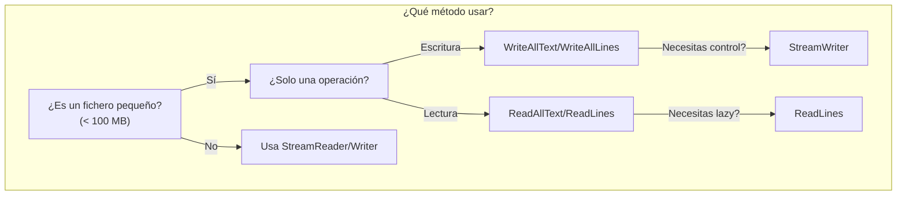

- [3. Ficheros de Texto Plano](#3-ficheros-de-texto-plano)
  - [3.2. Codificación de Caracteres: UTF-8, ASCII y Unicode](#32-codificación-de-caracteres-utf-8-ascii-y-unicode)
    - [3.2.1. ¿Qué es la Codificación?](#321-qué-es-la-codificación)
    - [3.2.2. Principales Codificaciones](#322-principales-codificaciones)
  - [3.3. Escritura de Ficheros de Texto](#33-escritura-de-ficheros-de-texto)
    - [3.3.1. Método Rápido: WriteAllText y WriteAllLines](#331-método-rápido-writealltext-y-writealllines)
    - [3.3.2. StreamWriter: Escritura Eficiente](#332-streamwriter-escritura-eficiente)
    - [3.3.3. Write vs WriteLine](#333-write-vs-writeline)
    - [3.3.4. Flush: Forzar Escritura Inmediata](#334-flush-forzar-escritura-inmediata)
  - [3.4. Lectura de Ficheros de Texto](#34-lectura-de-ficheros-de-texto)
    - [3.4.1. Método Rápido: ReadAllText y ReadAllLines](#341-método-rápido-readalltext-y-readalllines)
    - [3.4.2. StreamReader: Lectura Eficiente](#342-streamreader-lectura-eficiente)
    - [3.4.3. Ejemplo Práctico: Procesar Log Line](#343-ejemplo-práctico-procesar-log-line)
  - [3.5. Comparación de Métodos: ¿Cuál Usar?](#35-comparación-de-métodos-cuál-usar)
  - [3.6. Ejemplo Integrador: Sistema de Logs](#36-ejemplo-integrador-sistema-de-logs)

# 3. Ficheros de Texto Plano

Un **fichero de texto plano** es un archivo que contiene **solo caracteres legibles** (letras, números, símbolos) codificados en algún formato de texto (UTF-8, ASCII, etc.). **No contiene** formato (negritas, colores), imágenes ni estructuras binarias complejas.

> 📝 **Nota del Profesor**: Los ficheros de texto son la base de casi todo en programación: configuración, logs, datos tabulares (CSV), y comunicación entre sistemas. Dominar su manejo es fundamental.

**Ejemplos de ficheros de texto:**
- `.txt` → Archivos de texto sin formato
- `.csv` → Valores separados por comas
- `.json` → Datos estructurados en formato JSON
- `.xml` → Datos estructurados en XML
- `.md` → Markdown (documentación)
- `.log` → Archivos de registro (logs)
- `.config` → Archivos de configuración

**Comparación:**

```
FICHERO DE TEXTO (.txt):
┌─────────────────────────────────────┐
│ Hola mundo                          │
│ Esta es la segunda línea            │
└─────────────────────────────────────┘
Bytes:   [72][111][108][97][32][109]... 
        (H) (o)  (l)  (a) ( ) (m)...
        
FICHERO BINARIO (.docx, .jpg, .exe):
┌─────────────────────────────────────┐
│ [PK][03][04][14][00][06][00]...    │  ← No legible
│ [08][00][00][00][21][00][B2][AF]... │
└─────────────────────────────────────┘
```

## 3.2. Codificación de Caracteres: UTF-8, ASCII y Unicode

Antes de trabajar con texto, necesitamos entender **cómo se representan los caracteres en bytes**.

### 3.2.1. ¿Qué es la Codificación?

La **codificación** es el proceso de convertir **caracteres** (letras, símbolos) en **bytes** (números).

```
Carácter  →  [Codificación]  →  Bytes

   'A'    →    [ASCII]       →   65
   'Ñ'    →    [UTF-8]       →   195, 145
   '€'    →    [UTF-8]       →   226, 130, 172
```

### 3.2.2. Principales Codificaciones

| Codificación             | Descripción            | Rango                | Uso Típico                          |
| ------------------------ | ---------------------- | -------------------- | ----------------------------------- |
| **ASCII**                | American Standard Code | 0-127 (7 bits)       | Inglés básico (sin acentos)         |
| **Latin-1 (ISO-8859-1)** | ASCII extendido        | 0-255 (8 bits)       | Idiomas europeos (español, francés) |
| **UTF-8**                | Unicode 8-bit          | Variable (1-4 bytes) | **Estándar moderno (RECOMENDADO)**  |
| **UTF-16**               | Unicode 16-bit         | Variable (2-4 bytes) | Windows internamente                |
| **UTF-32**               | Unicode 32-bit         | 4 bytes por carácter | Procesamiento interno               |

**Ejemplo práctico:**

```csharp
using System;
using System.Text;

string texto = "Hola España €";

// UTF-8 (recomendado, 1-4 bytes por carácter)
byte[] bytesUTF8 = Encoding.UTF8.GetBytes(texto);
Console.WriteLine("UTF-8:");
Console.WriteLine($"  Texto:   {texto}");
Console.WriteLine($"  Bytes:  {bytesUTF8.Length}");
Console.WriteLine($"  Hex:    {BitConverter.ToString(bytesUTF8)}");

// ASCII (solo caracteres básicos)
try
{
    byte[] bytesASCII = Encoding.ASCII.GetBytes(texto);
    string recuperado = Encoding.ASCII.GetString(bytesASCII);
    Console.WriteLine("\nASCII:");
    Console.WriteLine($"  Original:     {texto}");
    Console.WriteLine($"  Recuperado:  {recuperado}"); // Pierde 'ñ' y '€'
}
catch
{
    Console.WriteLine("\nASCII:  No puede codificar caracteres especiales");
}

// UTF-16 (2-4 bytes, usado por Windows)
byte[] bytesUTF16 = Encoding.Unicode.GetBytes(texto);
Console.WriteLine("\nUTF-16:");
Console.WriteLine($"  Bytes: {bytesUTF16.Length}");
Console.WriteLine($"  Hex:   {BitConverter.ToString(bytesUTF16)}");
```

**Salida:**

```
UTF-8:
  Texto:  Hola España €
  Bytes: 15
  Hex:    48-6F-6C-61-20-45-73-70-61-C3-B1-61-20-E2-82-AC

ASCII:
  Original:    Hola España €
  Recuperado: Hola Espa? a ? 

UTF-16:
  Bytes: 28
  Hex:   48-00-6F-00-6C-00-61-00-20-00-45-00-73-00-70-00-61-00-F1-00-61-00-20-00-AC-20
```

> 💡 **Tip del Examinador**: Usa SIEMPRE UTF-8. Es el estándar moderno y evita problemas con caracteres especiales como la ñ, tildes, o símbolos como el €.

## 3.3. Escritura de Ficheros de Texto

### 3.3.1. Método Rápido: WriteAllText y WriteAllLines

Para ficheros **pequeños** donde puedes tener todo el contenido en memoria:

```csharp
using System;
using System.IO;
using System.Text;

// Método 1: WriteAllText (todo el texto de una vez)
string contenido = "Primera línea\nSegunda línea\nTercera línea";
File.WriteAllText("fichero1.txt", contenido, Encoding.UTF8);
Console.WriteLine("✓ Fichero creado con WriteAllText");

// Método 2: WriteAllLines (array de líneas)
string[] lineas = 
[
    "Línea 1: Encabezado",
    "Línea 2: Contenido",
    "Línea 3: Pie de página"
];

File.WriteAllLines("fichero2.txt", lineas, Encoding.UTF8);
Console.WriteLine("✓ Fichero creado con WriteAllLines");

// Método 3: AppendAllText (añadir al final)
File.AppendAllText("fichero1.txt", "\nLínea añadida al final", Encoding.UTF8);
Console.WriteLine("✓ Texto añadido con AppendAllText");

// Leer para verificar
string resultado = File.ReadAllText("fichero1.txt");
Console.WriteLine($"\nContenido final:\n{resultado}");
```

> ⚠️ **Advertencia**: WriteAllText SOBRESCRIBE el fichero si existe.

```csharp
// Crear fichero
File.WriteAllText("importante.txt", "Contenido original");

// ¡SOBRESCRIBE! El contenido anterior se pierde
File.WriteAllText("importante.txt", "Nuevo contenido");

// Solución: Usar AppendAllText para añadir
File.AppendAllText("importante.txt", "\nMás contenido");
```

### 3.3.2. StreamWriter: Escritura Eficiente

Para ficheros **grandes** o cuando escribes línea por línea:

```csharp
using System;
using System.IO;

// Crear fichero nuevo (sobrescribe si existe)
Console.WriteLine(">>> CREAR FICHERO NUEVO");

using var writer = new StreamWriter("log.txt");

writer.WriteLine("=== INICIO DEL LOG ===");
writer.WriteLine($"Fecha: {DateTime.Now}");
writer.WriteLine("Usuario: Admin");
writer.WriteLine("======================");

Console.WriteLine("✓ Fichero log.txt creado\n");

// AÑADIR al final (append: true)
Console.WriteLine(">>> AÑADIR AL FINAL (append)");

using var writer = new StreamWriter("log.txt", append: true);

writer.WriteLine($"[{DateTime.Now:HH:mm:ss}] Usuario inició sesión");
writer.WriteLine($"[{DateTime.Now:HH:mm:ss}] Operación ejecutada");
writer.WriteLine($"[{DateTime.Now:HH:mm:ss}] Usuario cerró sesión");

Console.WriteLine("✓ Líneas añadidas al log\n");

// Especificar codificación explícitamente
using var writer2 = new StreamWriter("utf8.txt", append: false, encoding: Encoding.UTF8);
writer2.WriteLine("Texto con caracteres especiales: España, €, ñ, á");

Console.WriteLine("✓ Fichero con UTF-8 creado\n");
```

**Comparación: Crear vs Añadir**

```csharp
string rutaTest = "test_append.txt";

// Escritura 1: Crear fichero
using var writer = new StreamWriter(rutaTest, append: false);
{
    writer.WriteLine("Línea 1 (primera escritura)");
}

// Escritura 2: SOBRESCRIBIR (append: false)
using var writer = new StreamWriter(rutaTest, append: false);
{
    writer.WriteLine("Línea 1 (segunda escritura)");
}

Console.WriteLine("Contenido después de sobrescribir:");
Console.WriteLine(File.ReadAllText(rutaTest));
// Solo muestra: "Línea 1 (segunda escritura)"

// Escritura 3: AÑADIR (append: true)
using var writer = new StreamWriter(rutaTest, append: true);
{
    writer.WriteLine("Línea 2 (añadida)");
}

File.Delete(rutaTest);
```

### 3.3.3. Write vs WriteLine

```csharp
using var writer = new StreamWriter("diferencia.txt");
{
    // Write: NO añade salto de línea
    writer.Write("Hola ");
    writer.Write("mundo ");
    writer.Write("sin ");
    writer.Write("saltos");
    
    // WriteLine: SÍ añade salto de línea
    writer.WriteLine(); // Salto de línea vacío
    writer.WriteLine("Esta es una línea completa");
    writer.WriteLine("Y esta es otra línea");
}

string contenido = File.ReadAllText("diferencia.txt");
Console.WriteLine("Contenido:");
Console.WriteLine(contenido);

// Salida:
// Hola mundo sin saltos
// Esta es una línea completa
// Y esta es otra línea

File.Delete("diferencia.txt");
```

### 3.3.4. Flush: Forzar Escritura Inmediata

Por defecto, `StreamWriter` usa un **buffer interno** para mejorar el rendimiento. Los datos no se escriben inmediatamente al disco.

```csharp
using System;
using System.IO;
using System.Threading;

string rutaLog = "log_flush.txt";

using var writer = new StreamWriter(rutaLog);
{
    writer.WriteLine("Línea 1 (en buffer)");
    Console.WriteLine("Escrito en buffer (aún no en disco)");
    Thread.Sleep(2000);
    
    // Forzar escritura a disco
    writer.Flush();
    Console.WriteLine("✓ Flush ejecutado (ahora SÍ está en disco)");
    Thread.Sleep(2000);
    
    writer.WriteLine("Línea 2 (también en buffer)");
} // Al salir del using, se hace Flush automático

Console.WriteLine("✓ Salida del using (Flush automático)");
```

**¿Cuándo usar `Flush()`?**

- ✅ **Logs críticos**: Si la aplicación puede crashear, queremos los logs en disco inmediatamente
- ✅ **Depuración**: Ver cambios en tiempo real
- ❌ **NO en bucles**: Afecta el rendimiento (espera escritura a disco en cada iteración)

```csharp
// ❌ MAL: Flush en cada iteración (muy lento)
using var writer = new StreamWriter("salida.txt");
{
    for (int i = 0; i < 10000; i++)
    {
        writer.WriteLine($"Línea {i}");
        writer.Flush(); // ← Espera escritura a disco 10,000 veces
    }
}

// ✓ BIEN: Dejar que el buffer haga su trabajo
using var writer = new StreamWriter("salida.txt");
{
    for (int i = 0; i < 10000; i++)
    {
        writer.WriteLine($"Línea {i}");
    }
} // Flush automático al final
```

## 3.4. Lectura de Ficheros de Texto

### 3.4.1. Método Rápido: ReadAllText y ReadAllLines

Para ficheros **pequeños** (< 100 MB):

```csharp
using System;
using System.IO;

// Crear fichero de prueba
string[] lineasPrueba = 
[
    "Primera línea",
    "Segunda línea",
    "Tercera línea con datos: 123",
    "Cuarta línea final"
];

File.WriteAllLines("prueba_lectura.txt", lineasPrueba);

// Método 1: ReadAllText (todo el contenido como string)
string contenidoCompleto = File.ReadAllText("prueba_lectura.txt");

Console.WriteLine(">>> ReadAllText (todo el texto):");
Console.WriteLine(contenidoCompleto);
Console.WriteLine($"\nLongitud total: {contenidoCompleto.Length} caracteres\n");

// Método 2: ReadAllLines (array de líneas)
string[] lineas = File.ReadAllLines("prueba_lectura.txt");

Console.WriteLine(">>> ReadAllLines (array de líneas):");
Console.WriteLine($"Total líneas: {lineas.Length}\n");

for (int i = 0; i < lineas.Length; i++)
{
    Console.WriteLine($"  [{i}] {lineas[i]}");
}

// Método 3: ReadLines (IEnumerable<string> - LAZY)
Console.WriteLine("\n>>> ReadLines (IEnumerable - evaluación diferida):");

IEnumerable<string> lineasLazy = File.ReadLines("prueba_lectura.txt");

foreach (string linea in lineasLazy)
{
    Console.WriteLine($"  → {linea}");
    
    if (linea.Contains("Segunda"))
    {
        Console.WriteLine("    (Deteniendo lectura)");
        break; // ¡No lee el resto!
    }
}

### 📝 Nota del Profesor: La importancia de la Evaluación Perezosa (Lazy)

En el mundo real, los ficheros pueden ser de gigabytes. 

*   **ReadAllLines**: Es como vaciar todo el contenido de una botella de agua en un cubo (la RAM). Si el cubo no es lo suficientemente grande, el programa "revienta" (OutMemoryException).
*   **ReadLines**: Es como beber de la botella con una pajita. Solo tomas lo que necesitas en cada momento.

**¿Por qué ReadLines es superior para grandes ficheros?**
1.  **Memoria Constante:** Da igual si el fichero tiene 10 líneas o 10 millones; el consumo de RAM es el mismo (solo la línea actual).
2.  **Velocidad de Inicio:** El procesamiento empieza inmediatamente sin esperar a leer todo el fichero.
3.  **Eficiencia LINQ:** Puedes hacer `.ReadLines(fichero).Take(5)` y el programa solo leerá las primeras 5 líneas del disco y cerrará el archivo.

File.Delete("prueba_lectura.txt");
```

**Diferencia clave: ReadAllLines vs ReadLines**

| Método | Tipo | Comportamiento |
|--------|------|----------------|
| `ReadAllLines` | Eager | Lee TODO a memoria inmediatamente |
| `ReadLines` | Lazy | Solo lee cuando se itera |

```csharp
// ReadAllLines: Lee TODO a memoria (eager)
string[] todo = File.ReadAllLines("grande.txt");
// Ya consumió 1GB de RAM

// ReadLines: Lee bajo demanda (lazy)
IEnumerable<string> bajoDemanda = File.ReadLines("grande.txt");
// Solo consume lo que iteras
var primero = bajoDemanda.First(); // Lee solo la primera línea
```

### 3.4.2. StreamReader: Lectura Eficiente

```csharp
using System;
using System.IO;

// Crear fichero de prueba
File.WriteAllText("procesar.txt", "ERROR: Conexión perdida\nINFO: Reintentando...\nWARNING: Tiempo de espera");

Console.WriteLine(">>> LECTURA CON StreamReader\n");

// Leer línea por línea
using var reader = new StreamReader("procesar.txt");
{
    string? linea;
    while ((linea = reader.ReadLine()) != null)
    {
        Console.WriteLine($"  → {linea}");
    }
}

// Leer todo el contenido
using var reader = new StreamReader("procesar.txt");
{
    string contenido = reader.ReadToEnd();
    Console.WriteLine($"\nContenido completo:\n{contenido}");
}

// Leer un número específico de caracteres
using var reader = new StreamReader("procesar.txt");
{
    char[] buffer = new char[10];
    int leidos = reader.Read(buffer, 0, buffer.Length);
    Console.WriteLine($"\nPrimeros {leidos} caracteres: {new string(buffer, 0, leidos)}");
}

File.Delete("procesar.txt");
```

### 3.4.3. Ejemplo Práctico: Procesar Log Line

```csharp
using System;
using System.IO;

File.WriteAllText("app.log", 
    "2025-01-15 10:30:15 INFO Aplicación iniciada\n" +
    "2025-01-15 10:30:20 ERROR Error de conexión a BD\n" +
    "2025-01-15 10:30:25 INFO Reintentando conexión...\n" +
    "2025-01-15 10:30:30 WARNING Timeout en operación\n" +
    "2025-01-15 10:30:35 INFO Aplicación finalizada");

Console.WriteLine("═══════════════════════════════════════════");
Console.WriteLine("  PROCESAMIENTO DE LOG");
Console.WriteLine("═══════════════════════════════════════════\n");

using var reader = new StreamReader("app.log");
{
    int lineasError = 0;
    int lineasWarning = 0;
    int lineasInfo = 0;
    
    string? linea;
    while ((linea = reader.ReadLine()) != null)
    {
        if (linea.Contains("ERROR"))
        {
            Console.WriteLine($"🔴 {linea}");
            lineasError++;
        }
        else if (linea.Contains("WARNING"))
        {
            Console.WriteLine($"🟡 {linea}");
            lineasWarning++;
        }
        else if (linea.Contains("INFO"))
        {
            lineasInfo++;
        }
    }
    
    Console.WriteLine("\n═══ RESUMEN ═══");
    Console.WriteLine($"Errores:    {lineasError}");
    Console.WriteLine($"Warnings:   {lineasWarning}");
    Console.WriteLine($"Info:      {lineasInfo}");
}

File.Delete("app.log");

Console.WriteLine("\n═══════════════════════════════════════════");
```

## 3.5. Comparación de Métodos: ¿Cuál Usar?

| Método | Cuándo Usar | Tamaño Máximo | Rendimiento |
|--------|-------------|---------------|-------------|
| `File.WriteAllText` | Ficheos pequeños, escritura puntual | ~100 MB | Rápido |
| `File.WriteAllLines` | Ficheos pequeños, array de líneas | ~100 MB | Rápido |
| `StreamWriter` | Ficheos grandes, escribir poco a poco | Ilimitado | Medio |
| `File.ReadAllText` | Ficheos pequeños, todo a memoria | ~100 MB | Rápido |
| `File.ReadAllLines` | Ficheos pequeños, procesar líneas | ~100 MB | Rápido |
| `File.ReadLines` | Ficheos grandes, evaluación lazy | Ilimitado | Medio |
| `StreamReader` | Ficheos grandes, control total | Ilimitado | Medio |



> 💡 **Tip del Examinador**: La pregunta clave es: "¿Cómo leer un fichero grande sin agotar la memoria?" La respuesta es usar `StreamReader` con un bucle o `File.ReadLines` (lazy).

## 3.6. Ejemplo Integrador: Sistema de Logs

```csharp
using System;
using System.IO;

class SistemaLogs
{
    private readonly string rutaLog;
    
    public SistemaLogs(string nombreArchivo)
    {
        // Asegurar extensión .log
        string nombre = Path.GetFileNameWithoutExtension(nombreArchivo);
        this.rutaLog = Path.Combine(Path.GetTempPath(), $"{nombre}.log");
    }
    
    public void Log(string nivel, string mensaje)
    {
        string entrada = $"[{DateTime.Now:yyyy-MM-dd HH:mm:ss}] [{nivel}] {mensaje}";
        
        using var writer = new StreamWriter(rutaLog, append: true);
        writer.WriteLine(entrada);
    }
    
    public void Info(string mensaje) => Log("INFO", mensaje);
    public void Warning(string mensaje) => Log("WARNING", mensaje);
    public void Error(string mensaje) => Log("ERROR", mensaje);
    
    public void MostrarLogs(string? filtroNivel = null)
    {
        if (!File.Exists(rutaLog))
        {
            Console.WriteLine("No hay logs.");
            return;
        }
        
        Console.WriteLine($"\n═══ LOGS: {rutaLog} ═══");
        
        foreach (var linea in File.ReadLines(rutaLog))
        {
            if (filtroNivel == null || linea.Contains(filtroNivel))
            {
                Console.WriteLine(linea);
            }
        }
    }
}

// Uso
var logs = new SistemaLogs("mi_aplicacion");

logs.Info("Aplicación iniciada");
logs.Info("Cargando configuración");
logs.Warning("Configuración no encontrada, usando valores por defecto");
logs.Error("Error al conectar con servidor");
logs.Info("Aplicación finalizada");

logs.MostrarLogs("ERROR");
```

> 📝 **Nota del Profesor**: Este patrón de sistema de logs es muy común en aplicaciones reales. Puedes expandirlo para filtrar por fecha, nivel, o enviar los logs a un servidor remoto.
