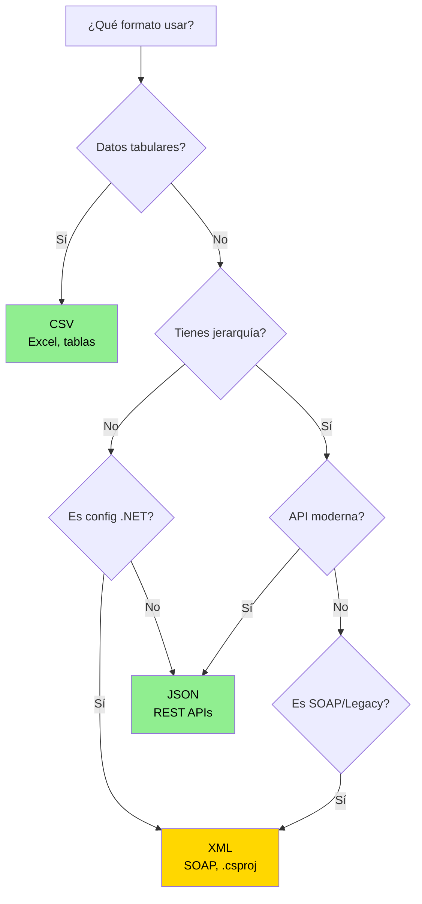

- [6. XML Estructurado](#6-xml-estructurado)
  - [6.1. Introducción: ¿Qué es XML y Cuándo Usarlo?](#61-introducción-qué-es-xml-y-cuándo-usarlo)
  - [6.2. Sintaxis Básica de XML](#62-sintaxis-básica-de-xml)
  - [6.3. Serialización XML con XmlSerializer](#63-serialización-xml-con-xmlserializer)
  - [6.4. Deserialización XML](#64-deserialización-xml)
  - [6.5. Objetos Anidados y Jerarquías](#65-objetos-anidados-y-jerarquías)
  - [6.6. LINQ to XML: Consultas sobre Datos XML](#66-linq-to-xml-consultas-sobre-datos-xml)
  - [6.7. Manejo de Errores en XML](#67-manejo-de-errores-en-xml)
  - [6.8. Comparación Final: CSV vs JSON vs XML](#68-comparación-final-csv-vs-json-vs-xml)

# 6. XML Estructurado

## 6.1. Introducción: ¿Qué es XML y Cuándo Usarlo?

**XML** (eXtensible Markup Language) es un formato de texto que permite definir estructuras de datos jerárquicas. Aunque ha perdido popularidad frente a JSON, sigue siendo esencial en algunos contextos.

> 📝 **Nota del Profesor**: XML todavía se usa mucho en entornos empresariales, servicios SOAP, archivos de configuración (como .csproj en .NET), y sistemas legacy. Es importante conocerlo.

**¿Cuándo usar XML?**

✅ **Configuración**: Archivos .csproj, .config  
✅ **Servicios SOAP**: APIs enterprise legacy  
✅ **Documentos**: Word, Excel (OpenXML)  
✅ **Datos jerárquicos complejos**: XML es más expresivo que JSON para jerarquías  
✅ **Validación**: XML Schema (XSD)  

## 6.2. Sintaxis Básica de XML

```xml
<?xml version="1.0" encoding="UTF-8"?>
<alumno id="1">
    <nombre>Ana García</nombre>
    <edad>20</edad>
    <nota>8.5</nota>
    <direccion>
        <calle>Gran Vía</calle>
        <ciudad>Madrid</ciudad>
    </direccion>
    <notas>
        <nota>8.5</nota>
        <nota>7.0</nota>
    </notas>
</alumno>
```

**Conceptos clave:**

- **Elementos**: `<nombre>...</nombre>`
- **Atributos**: `id="1"` (en la etiqueta de apertura)
- **Jerarquía**: Elementos dentro de elementos
- **Declaración**: `<?xml ... ?>`

## 6.3. Serialización XML con XmlSerializer

### Configuración Inicial

```csharp
// NecesitasSystem.Xml.Serialization
using System.Xml.Serialization;
```

### Serialización Básica

```csharp
using System.Xml.Serialization;

public record Alumno(
    [property: XmlAttribute("id")] 
    int Id,
    
    [property: XmlElement("nombre")] 
    string Nombre,
    
    [property: XmlElement("edad")] 
    int Edad,
    
    [property: XmlElement("nota")] 
    double Nota
);

var alumno = new Alumno(1, "Ana García", 20, 8.5);

var serializador = new XmlSerializer(typeof(Alumno));

using var writer = new StreamWriter("alumno.xml");
serializador.Serialize(writer, alumno);

Console.WriteLine("✓ XML guardado");

// Resultado:
// <?xml version="1.0" encoding="utf-8"?>
// <Alumno id="1">
//   <nombre>Ana García</nombre>
//   <edad>20</edad>
//   <nota>8.5</nota>
// </Alumno>
```

### Serialización sin Namespaces

```csharp
var serializador = new XmlSerializer(typeof(Alumno));

var namespaces = new XmlSerializerNamespaces();
namespaces.Add("", ""); // Eliminar namespaces

using var writer = new StreamWriter("alumno.xml");
serializador.Serialize(writer, alumno, namespaces);
```

### Serializar Listas

```csharp
using System.Xml.Serialization;

public record Alumno(int Id, string Nombre, double Nota);

var alumnos = new List<Alumno>
{
    new(1, "Ana García", 8.5),
    new(2, "Juan Pérez", 7.0),
    new(3, "María López", 9.2)
};

var serializador = new XmlSerializer(typeof(List<Alumno>));

using var writer = new StreamWriter("alumnos.xml");
serializador.Serialize(writer, alumnos);
```

## 6.4. Deserialización XML

```csharp
var serializador = new XmlSerializer(typeof(Alumno));

using var reader = new StreamReader("alumno.xml");
var alumno = (Alumno)serializador.Deserialize(reader)!;

Console.WriteLine($"ID: {alumno.Id}");
Console.WriteLine($"Nombre: {alumno.Nombre}");
```

### 📝 Nota del Profesor: Streams y Eficiencia XML

Al igual que con JSON, es mejor alimentar al `XmlSerializer` con un **flujo de datos (Stream)** en lugar de cargar todo el texto del XML en un string.

```csharp
// ✓ MEJOR: Uso de File.OpenRead() directamente
using var stream = File.OpenRead("alumnos.xml");
var alumnos = (List<Alumno>)serializador.Deserialize(stream)!;
```

Esto evita que la memoria RAM seature cuando el XML tiene miles de etiquetas y registros. Además, si usas **LINQ to XML**, `XDocument.Load("archivo.xml")` ya usa internamente un Stream para ser eficiente. ¡Evita `XDocument.Parse(string)` con ficheros reales!

### Deserializar Listas

```csharp
var serializador = new XmlSerializer(typeof(List<Alumno>));

using var reader = new StreamReader("alumnos.xml");
var alumnos = (List<Alumno>)serializador.Deserialize(reader)!;

foreach (var a in alumnos)
{
    Console.WriteLine($"{a.Nombre}: {a.Nota}");
}
```

## 6.5. Objetos Anidados y Jerarquías

```csharp
using System.Xml.Serialization;

public record Direccion(string Calle, string Ciudad);
public record Alumno(int Id, string Nombre, Direccion Direccion);

var alumno = new Alumno(
    1, 
    "Ana García", 
    new Direccion("Gran Vía", "Madrid")
);

var serializador = new XmlSerializer(typeof(Alumno));
var namespaces = new XmlSerializerNamespaces();
namespaces.Add("", "");

using var writer = new StreamWriter("alumno_completo.xml");
serializador.Serialize(writer, alumno, namespaces);

Console.WriteLine(File.ReadAllText("alumno_completo.xml"));

/* Salida:
<Alumno Id="1">
  <Nombre>Ana García</Nombre>
  <Direccion>
    <Calle>Gran Vía</Calle>
    <Ciudad>Madrid</Ciudad>
  </Direccion>
</Alumno>
*/
```

## 6.6. LINQ to XML: Consultas sobre Datos XML

```csharp
using System.Xml.Linq;

// Cargar XML
XDocument doc = XDocument.Load("alumnos.xml");

// Consultar con LINQ
var nombres = doc.Descendants("Nombre")
    .Select(x => x.Value);

foreach (var n in nombres)
{
    Console.WriteLine(n);
}

// Filtrar por nota
var aprobados = doc.Descendants("Alumno")
    .Where(x => (double)x.Element("Nota")! >= 5)
    .Select(x => new 
    { 
        Nombre = x.Element("Nombre")?.Value,
        Nota = (double)x.Element("Nota")!
    });

foreach (var a in aprobados)
{
    Console.WriteLine($"{a.Nombre}: {a.Nota}");
}
```

## 6.7. Manejo de Errores en XML

```csharp
try
{
    var doc = XDocument.Load("archivo_invalido.xml");
}
catch (XmlException ex)
{
    Console.WriteLine($"Error XML: {ex.Message}");
}
catch (FileNotFoundException ex)
{
    Console.WriteLine($"Archivo no encontrado: {ex.Message}");
}
```

## 6.8. Comparación Final: CSV vs JSON vs XML

| Característica | **CSV** | **JSON** | **XML** |
|---------------|---------|-----------|----------|
| **Legibilidad** | Alta | Alta | Media |
| **Tamaño** | Pequeño | Medio | Grande |
| **Jerarquías** | ❌ No | ✅ Sí | ✅ Sí |
| **APIs modernas** | ✅ CSV | ✅ JSON | ❌ SOAP |
| **Configuración** | ❌ No | ✅ Sí | ✅ Sí |
| **Validación** | ❌ No | ❌ No | ✅ XSD |

**¿Cuándo usar cada uno?**

- **CSV**: Datos tabulares simples, export/import Excel
- **JSON**: APIs REST, datos estructurados, configuración moderna
- **XML**: Configuración .NET, servicios SOAP legacy, documentos



> 📝 **Nota del Profesor**: XML ha perdido terreno frente a JSON, pero sigue siendo relevante. Aprende los tres formatos y usa el más apropiado para cada situación.
