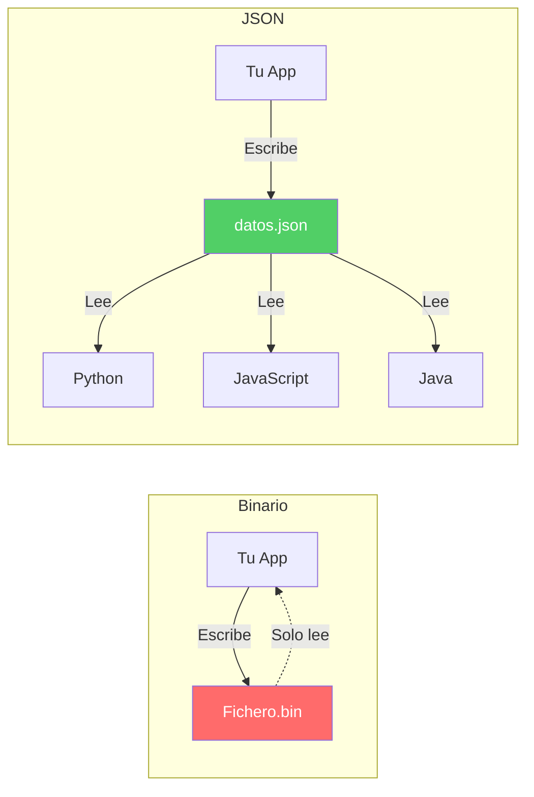

- [7. Ficheros Binarios y el Riesgo del Acoplamiento](#7-ficheros-binarios-y-el-riesgo-del-acoplamiento)
  - [7.1. Introducción: ¿Qué es un Fichero Binario?](#71-introducción-qué-es-un-fichero-binario)
  - [7.2. BinaryReader y BinaryWriter](#72-binaryreader-y-binarywriter)
    - [Escritura Binaria](#escritura-binaria)
    - [Lectura Binaria](#lectura-binaria)
  - [7.3. Serialización Binaria de Objetos](#73-serialización-binaria-de-objetos)
    - [Serialización Manual](#serialización-manual)
  - [7.4. Acceso Aleatorio con FileStream y Seek](#74-acceso-aleatorio-con-filestream-y-seek)
    - [El puntero de posición](#el-puntero-de-posición)
    - [Tamaño de los Tipos de Datos](#tamaño-de-los-tipos-de-datos)
  - [7.5. El GRAN PROBLEMA: Acoplamiento y Falta de Interoperabilidad](#75-el-gran-problema-acoplamiento-y-falta-de-interoperabilidad)
    - [El Problema del Acoplamiento](#el-problema-del-acoplamiento)
    - [Comparación: Binario vs JSON](#comparación-binario-vs-json)
  - [7.6. Casos de Uso Válidos para Ficheros Binarios](#76-casos-de-uso-válidos-para-ficheros-binarios)
    - [✅ Cachés Temporales de Alto Rendimiento](#-cachés-temporales-de-alto-rendimiento)
    - [✅ Formatos Estándar Binarios (con especificación)](#-formatos-estándar-binarios-con-especificación)
    - [❌ Casos Donde NO Usar Binario](#-casos-donde-no-usar-binario)
  - [7.7. Resumen y Recomendaciones](#77-resumen-y-recomendaciones)

# 7. Ficheros Binarios y el Riesgo del Acoplamiento

## 7.1. Introducción: ¿Qué es un Fichero Binario?

Un **fichero binario** almacena datos en formato raw (bytes puros), sin representar texto legible. A diferencia de los ficheros de texto, no puedes abrirlos con un editor de texto.

**Características:**

✅ **Más pequeño**: No hay conversión de texto  
✅ **Más rápido**: Lectura directa de bytes  
✅ **Soporta cualquier tipo**: Imágenes, audio, objetos...  
❌ **No legible**: Necesitas saber el formato  
❌ **Acoplado**: Solo lo lee tu aplicación  

## 7.2. BinaryReader y BinaryWriter

### Escritura Binaria

```csharp
using System;
using System.IO;

string ruta = "datos.bin";

// Escribir tipos primitivos
using var writer = new BinaryWriter(File.Create(ruta));

writer.Write(42);              // int
writer.Write(3.14);           // double
writer.Write("Hola mundo");    // string
writer.Write(true);            // bool

Console.WriteLine("✓ Binario escrito");

// Ver contenido (será ilegible)
Console.WriteLine($"Tamaño: {new FileInfo(ruta).Length} bytes");
```

### Lectura Binaria

```csharp
using var reader = new BinaryReader(File.OpenRead(ruta));

int numero = reader.ReadInt32();
double decimals = reader.ReadDouble();
string texto = reader.ReadString();
bool booleano = reader.ReadBoolean();

Console.WriteLine($"int: {numero}");
Console.WriteLine($"double: {decimals}");
Console.WriteLine($"string: {texto}");
Console.WriteLine($"bool: {booleano}");

File.Delete(ruta);
```

## 7.3. Serialización Binaria de Objetos

### Serialización Manual

```csharp
public record Persona(string Nombre, int Edad);

var persona = new Persona("Ana", 30);

using var stream = new MemoryStream();
using var writer = new BinaryWriter(stream);

// Escribir longitud del string + contenido
string nombre = persona.Nombre;
writer.Write(nombre.Length);
writer.Write(nombre);
writer.Write(persona.Edad);

// Leer
stream.Position = 0;
using var reader = new BinaryReader(stream);
string nombreLeido = reader.ReadString();
int edadLeida = reader.ReadInt32();

Console.WriteLine($"{nombreLeida}, {edadLeida}");
```

## 7.4. Acceso Aleatorio con FileStream y Seek

### El puntero de posición

```csharp
string ruta = "numeros.bin";

// Escribir 10 enteros
using var fs = new FileStream(ruta, FileMode.Create);
for (int i = 0; i < 10; i++)
{
    fs.Write(BitConverter.GetBytes(i), 0, 4);
}

// Leer el 5º número (posición 4 * 4 = 16)
fs.Seek(16, SeekOrigin.Begin);
byte[] buffer = new byte[4];
fs.Read(buffer, 0, 4);
int valor = BitConverter.ToInt32(buffer, 0);

Console.WriteLine($"Valor en posición 5: {valor}"); // 4
```

El principal problema de los ficheros binarios es que el formato es completamente opaco. Si cambias el orden de escritura o el tipo de dato, la lectura se rompe. Esto genera un acoplamiento total entre tu aplicación y el formato del fichero, lo que hace que sea difícil de mantener y compartir con otras aplicaciones o lenguajes.

Además necesitas saber exactamente cómo se escribió el fichero para poder leerlo correctamente, y el tamaño de los tipos de datos. Esto hace que los ficheros binarios sean muy frágiles y difíciles de depurar, especialmente si el formato no está bien documentado o si lo modificas en el futuro.

### Tamaño de los Tipos de Datos
| Tipo de Dato | Tamaño (bytes) | Tamaño (bits) |
|--------------|-----------------|----------------|
| int          | 4               | 32             |
| double       | 8               | 64             |
| float        | 4               | 32             |
| bool         | 1               | 8              |
| char         | 2               | 16             |
| string        | Variable (4 bytes para longitud + contenido) | Variable |
| byte[]        | Variable        | Variable       |
| Persona (Nombre + Edad) | Variable (4 bytes para longitud del nombre + contenido + 4 bytes para edad) | Variable |

## 7.5. El GRAN PROBLEMA: Acoplamiento y Falta de Interoperabilidad

> ⚠️ **Advertencia**: Los ficheros binarios son muy peligrosos por el acoplamiento. ¡Lee esto con atención!

### El Problema del Acoplamiento

```csharp
// Tu aplicación escribe:
writer.Write("Ana");
writer.Write(30);

// Otra aplicación intenta leer:
string nombre = reader.ReadString(); // Espera string
int edad = reader.ReadInt32();       // Espera int

// ❌ PROBLEMA: Si cambias el orden o tipo, TODO se rompe
```

**El fichero binario solo lo puede leer TU programa.**

### Comparación: Binario vs JSON

| Aspecto | **Binario** | **JSON** |
|---------|-------------|----------|
| Legibilidad | ❌ No | ✅ Sí |
| Interoperabilidad | ❌ Solo tu app | ✅ Cualquier lenguaje |
| Depuración | ❌ Imposible | ✅ Fácil |
| Tamaño | ✅ Muy pequeño | ✅ Pequeño |
| Velocidad | ✅ Muy rápido | ✅ Rápido |



## 7.6. Casos de Uso Válidos para Ficheros Binarios

### ✅ Cachés Temporales de Alto Rendimiento

```csharp
// Cache en memoria (rápido, temporal)
var cache = new Dictionary<string, byte[]>();

// Serializar a binario para cache en disco
// Solo si necesitas persistencia temporal
```

### ✅ Formatos Estándar Binarios (con especificación)

- **PNG/JPG**: Imágenes (especificación pública)
- **MP3**: Audio (especificación pública)
- **PDF**: Documentos (especificación pública)

> 💡 **Tip del Examinador**: Si el formato tiene una especificación pública y documentada (como PNG, PDF), es aceptable. Si es un formato propietario que solo tú vas a usar... usa JSON o XML.

### ❌ Casos Donde NO Usar Binario

```csharp
// ❌ NO guardes objetos de tu dominio en binario
public class Alumno { ... }
writer.Write(alumno); // ¡Acoplamiento máximo!

// ✅ USA JSON o XML
string json = JsonSerializer.Serialize(alumno);
File.WriteAllText("alumno.json", json);
```

## 7.7. Resumen y Recomendaciones

| Recomendación | ✅ Sí | ❌ No |
|-------------|-------|-------|
| Guardar datos de usuario | JSON, XML | Binario |
| Caché temporal | Binario ok | - |
| Imágenes/audio | Formatos estándar | Binario propio |
| Configuración | JSON/XML | Binario |
| Intercambio de datos | JSON/XML | Binario |
| Depuración | JSON/XML | Binario |

> 📝 **Nota del Profesor**: Mi recomendación personal: **Evita los ficheros binarios a menos que sea absolutamente necesario**. JSON y XML te ahorrarán muchos dolores de cabeza por acoplamiento. Los ficheros binarios son una optimización prematura en el 99% de los casos.

> 💡 **Tip del Examinador**: En el examen, la pregunta clave es "¿por qué no usar binario?" La respuesta es **acoplamiento**: el fichero binario solo lo puede leer tu aplicación, mientras que JSON/XML es universal.
