- [10. Resumen y Mapa Mental](#10-resumen-y-mapa-mental)

# 10. Resumen y Mapa Mental

## Resumen Ejecutivo

Esta unidad ha cubierto los fundamentos de la **lectura y escritura de información externa** en C# .NET, incluyendo:

1. **Streams y I/O**: Comprensión de flujos de datos, uso de `using` para gestión de recursos
2. **Sistema de Ficheros**: Clases `File`, `Directory`, `Path`, `FileInfo`
3. **Ficheros de Texto**: Escritura y lectura con `StreamReader`/`StreamWriter`
4. **Formato CSV**: DTOs, lectura/escritura con LINQ
5. **Formato JSON**: Serialización con `System.Text.Json`
6. **Formato XML**: Serialización con `XmlSerializer`
7. **Ficheros Binarios**: Riesgos de acoplamiento
8. **Utilidades**: Ficheros temporales, ZIP, configuración

## Mapa Mental

```mermaid
graph TD
    UD08["UD08: Ficheros y Formatos de Intercambio"] --> IO["Fundamentos I/O"]
    UD08 --> SISTEMA["Sistema de Ficheros"]
    UD08 --> TEXTO["Ficheros de Texto"]
    UD08 --> CSV["CSV + DTOs"]
    UD08 --> JSON["JSON"]
    UD08 --> XML["XML"]
    UD08 --> BIN["Binarios"]
    UD08 --> UTIL["Utilidades"]
    
    IO --> STREAMS["Streams"]
    IO --> USING["using<br/>IDisposable"]
    IO --> LOCKS["Locks/Candados"]
    
    STREAMS --> FS["FileStream"]
    STREAMS --> MS["MemoryStream"]
    STREAMS --> SR["StreamReader"]
    STREAMS --> SW["StreamWriter"]
    
    SISTEMA --> FILE["File"]
    SISTEMA --> DIROPS["Directory"]
    SISTEMA --> PATH["Path"]
    SISTEMA --> INFO["FileInfo"]
    
    CSV --> DTOS["DTO Pattern"]
    CSV --> LECT["Lectura CSV"]
    CSV --> ESCR["Escritura CSV"]
    CSV --> LINQ["LINQ processing"]
    
    JSON --> SERI["Serialize"]
    JSON --> DESER["Deserialize"]
    JSON --> OPTS["Options"]
    
    XML --> XS["XmlSerializer"]
    XML --> LINQ2XML["LINQ to XML"]
    
    BIN --> PELIGRO["⚠️ Acoplamiento"]
    
    UTIL --> TEMP["Temporales"]
    UTIL --> ZIP["ZIP Compression"]
    UTIL --> CFG["Config JSON"]
    
    style UD08 fill:#ff9900,color:#fff,stroke:#333,stroke-width:4px
```

## Checklist de Evaluación

### Conceptos Fundamentales
- [ ] Entiendo qué es un Stream y por qué se usa
- [ ] Sé usar `using` para gestionar recursos IDisposable
- [ ] Conozco la diferencia entre rutas absolutas y relativas

### Sistema de Ficheros
- [ ] Puedo usar `File.Exists()`, `File.Copy()`, `File.Move()`, `File.Delete()`
- [ ] Puedo usar `Directory.CreateDirectory()`, `GetFiles()`, `GetDirectories()`
- [ ] Sé usar `Path.Combine()` para construir rutas

### Ficheros de Texto
- [ ] Puedo escribir con `StreamWriter` y `File.WriteAllText()`
- [ ] Puedo leer con `StreamReader` y `File.ReadAllText()`
- [ ] Conozco la diferencia entre `ReadAllLines` y `ReadLines` (lazy)

### CSV
- [ ] Sé crear un DTO para CSV
- [ ] Puedo escribir y leer CSV con LINQ
- [ ] Sé manejar comas en los datos

### JSON
- [ ] Uso `JsonSerializer.Serialize()` y `Deserialize()`
- [ ] Configuro `WriteIndented` para JSON legible
- [ ] Uso `JsonPropertyName` para mapeo de nombres

### XML
- [ ] Uso `XmlSerializer` para serializar
- [ ] Conozco la diferencia con JSON

### Binarios
- [ ] Conozco los riesgos de acoplamiento
- [ ] Sé cuándo NO usar binario

## Preguntas de Examen Frecuentes

1. **¿Por qué usar `using` siempre?**
   > Para evitar memory leaks y resource leaks

2. **¿Qué diferencia hay entre `ReadAllText` y `StreamReader`?**
   > `ReadAllText` carga todo en memoria, `StreamReader` es streaming

3. **¿Cuándo usar CSV vs JSON vs XML?**
   > CSV: tablas simples; JSON: APIs modernas; XML: configuración .NET, SOAP

4. **¿Por qué evitar binario?**
   > Acoplamiento: solo tu app puede leerlo

5. **¿Cómo buscar ficheros con LINQ?**
   > `DirectoryInfo.GetFiles()` + `.Where()` + `.OrderBy()`

> 📝 **Nota del Profesor**: Esta unidad es práctica. La clave es practicar mucho con code. No te limites a leer, ¡escribe código!

> 💡 **Tip del Examinador**: En el examen suelen preguntar sobre `using`, diferencias entre formatos, y LINQ con ficheros. Repasa los ejemplos de código.
