# 🎓 Guía Maestra: Sistema de Gestión Académica (DAW)


---

## 1. El Problema y el Enunciado
El centro educativo ***"DAW Academy"*** requiere un sistema para gestionar su base de datos de **Estudiantes** y **Docentes**.

### El Reto Académico
No se trata solo de almacenar datos, sino de garantizar su **integridad** y permitir la toma de decisiones mediante **informes estadísticos**.
*   **Gestión de Entidades:** Manejo de jerarquías (Herencia) para evitar redundancia de datos.
*   **Validación de Dominio:** Los datos deben cumplir reglas estrictas (DNI válido, notas en rango, experiencia no negativa).
*   **Motor de Búsqueda:** Implementar filtrado dinámico y ordenación multiaxis (por Nota, por Experiencia, por DNI, etc.).
*   **Optimización:** Implementar una caché LRU para optimizar las lecturas repetidas por ID.
*   **Estructuras de Datos:** Se usa `Dictionary` para búsquedas O(1) en el Repository.

---

### Requisitos Funcionales, No Funcionales y de Información del Sistema

Los requisitos funcionales describen las operaciones que el sistema debe realizar. Se organizan por actor y por categoría de funcionalidad.

#### 1.1 Gestión de Personas (General)

| Código   | Requisito       | Descripción                                                                                                                                                       |
| -------- | --------------- | ----------------------------------------------------------------------------------------------------------------------------------------------------------------- |
| RF-GP-01 | Listar Personal | El sistema deberá mostrar un listado completo de todo el personal (estudiantes y docentes) ordenado por diferentes criterios (ID, DNI, Apellidos, Nombre, Ciclo). |
| RF-GP-02 | Buscar por DNI  | El sistema deberá permitir buscar cualquier persona mediante su DNI, mostrando sus datos completos.                                                               |
| RF-GP-03 | Buscar por ID   | El sistema deberá permitir buscar cualquier persona mediante su identificador único (ID).                                                                         |

#### 1.2 Gestión de Estudiantes

| Código   | Requisito              | Descripción                                                                                                                                                                       |
| -------- | ---------------------- | --------------------------------------------------------------------------------------------------------------------------------------------------------------------------------- |
| RF-GE-01 | Listar Estudiantes     | El sistema deberá mostrar un listado de estudiantes ordenado por diferentes criterios (ID, DNI, Apellidos, Nombre, Nota, Curso, Ciclo).                                           |
| RF-GE-02 | Añadir Estudiante      | El sistema deberá permitir registrar nuevos estudiantes con validación completa (DNI válido, nombre, apellidos, nota 0-10, ciclo y curso).                                        |
| RF-GE-03 | Actualizar Estudiante  | El sistema deberá permitir modificar los datos de un estudiante existente tras verificar su existencia mediante DNI.                                                              |
| RF-GE-04 | Gestionar Baja Estudiante | El sistema permitirá marcar como baja (borrado lógico) a un estudiante tras buscarlo por DNI, preservando su historial. También permitirá su reactivación mediante la actualización. |
| RF-GE-05 | Informe de Rendimiento    | El sistema deberá generar informes estadísticos de estudiantes con métricas (total, media, aprobados, suspensos) y filtrado por alcance (global, ciclo, curso, clase específica). Solo considera estudiantes activos. |
| RF-GE-06 | Paginación de Listados    | El sistema permitirá recuperar estudiantes de forma paginada para mejorar la eficiencia del repositorio. |

#### 1.3 Gestión de Docentes

| Código   | Requisito              | Descripción                                                                                                                                   |
| -------- | ---------------------- | --------------------------------------------------------------------------------------------------------------------------------------------- |
| RF-GD-01 | Listar Docentes        | El sistema deberá mostrar un listado de docentes ordenado por diferentes criterios (ID, DNI, Apellidos, Nombre, Experiencia, Módulo, Ciclo).  |
| RF-GD-02 | Añadir Docente         | El sistema deberá permitir registrar nuevos docentes con validación completa (DNI válido, nombre, apellidos, experiencia ≥ 0, módulo, ciclo). |
| RF-GD-03 | Actualizar Docente     | El sistema deberá permitir modificar los datos de un docente existente tras verificar su existencia mediante DNI.                             |
| RF-GD-04 | Gestionar Baja Docente | El sistema permitirá marcar como baja (borrado lógico) a un docente tras buscarlo por DNI, preservando su historial. También permitirá su reactivación mediante la actualización. |
| RF-GD-05 | Informe de Experiencia | El sistema deberá generar informes estadísticos de docentes con métricas (total, experiencia media) y filtrado por ciclo. Solo considera docentes activos. |
| RF-GD-06 | Mantenimiento (Vacuum) | El sistema permitirá compactar el almacén binario eliminando fragmentación física pero manteniendo íntegro el historial de bajas. |

#### 1.4 Gestión de Importación/Exportación

| Código   | Requisito              | Descripción                                                                                                                                 |
| -------- | ---------------------- | ------------------------------------------------------------------------------------------------------------------------------------------- |
| RF-IE-01 | Importar Datos        | El sistema deberá permitir importar datos desde un archivo externo en el formato configurado, validando la integridad de los datos.            |
| RF-IE-02 | Exportar Datos        | El sistema deberá permitir exportar todos los datos actuales a un archivo externo en el formato configurado.                                     |

#### 1.5 Gestión de Backup

| Código   | Requisito              | Descripción                                                                                                                                 |
| -------- | ---------------------- | ------------------------------------------------------------------------------------------------------------------------------------------- |
| RF-BK-01 | Realizar Backup       | El sistema deberá crear una copia de seguridad en formato ZIP contendo los datos en el formato configurado (JSON por defecto).             |
| RF-BK-02 | Restaurar Backup      | El sistema deberá permitir restaurar una copia de seguridad desde un archivo ZIP, reemplazando todos los datos actuales.                     |
| RF-BK-03 | Listar Backups        | El sistema deberá mostrar un listado de las copias de seguridad disponibles con su fecha, tamaño y ubicación.                               |

---

### 1.6 Requisitos No Funcionales

Los requisitos no funcionales describen las cualidades y restricciones del sistema.

| Código | Requisito | Descripción |
|--------|-----------|-------------|
| RNF-01 | Rendimiento | Las búsquedas por ID y DNI deben ser O(1). |
| RNF-02 | Integridad | El DNI debe ser único y válido. No se permiten duplicados incluso tras bajas. |
| RNF-03 | Persistencia | Los datos deben persistir entre ejecuciones (excepto en repositorio Memory). |
| RNF-04 | Configurabilidad | El tipo de repositorio, storage y backup debe ser configurable sin recompilar. |
| RNF-05 | Robustez | El sistema debe manejar errores de forma correcta con mensajes claros al usuario. |
| RNF-06 | Trazabilidad | Todas las operaciones deben estar registradas en log. |
| RNF-07 | Recuperación | El sistema debe permitir restaurar desde backup en caso de pérdida de datos. |

---

### 1.7 Requisitos de Información

Los requisitos de información describen los datos que el sistema debe gestionar y mantener.

#### 1.7.1 Entidades del Sistema

| Entidad        | Atributos                                                   | Descripción                                                                                       |
| -------------- | ----------------------------------------------------------- | ------------------------------------------------------------------------------------------------- |
| **Persona**    | Id, Dni, Nombre, Apellidos, CreatedAt, UpdatedAt, IsDeleted | Clase base abstracta que representa cualquier persona del sistema. Identidad única basada en DNI. |
| **Estudiante** | Calificacion (0-10), Ciclo, Curso                           | Hereda de Persona. Representa a un alumno con su rendimiento académico.                           |
| **Docente**    | Experiencia (años), Especialidad, Ciclo                     | Hereda de Persona. Representa a un profesor con su experiencia profesional.                       |

#### 1.7.2 ValoresEnumerados

| Enum                 | Valores                                                             | Descripción                                        |
| -------------------- | ------------------------------------------------------------------- | -------------------------------------------------- |
| **Ciclo**            | DAM, DAW, ASIR                                                      | Ciclos formativos disponibles en el centro.        |
| **Curso**            | Primero, Segundo                                                    | Curso académico dentro del ciclo.                  |
| **TipoOrdenamiento** | Id, Dni, Apellidos, Nombre, Nota, Experiencia, Curso, Ciclo, Modulo | Criterios de ordenación disponibles para listados. |
| **OpcionMenu**       | 0-17                                                                | Opciones del menú principal de la aplicación.      |
| **TipoPersona**      | Estudiante, Docente                                                 | Tipo de persona del sistema.                       |
| **RepositoryType**   | Memory, Binary, Json                                                | Tipos de repositorio disponibles.                  |

#### 1.7.3 DatosDerivados

| Atributo                    | Fórmula/Descripción                                                    | Entidad           |
| --------------------------- | ---------------------------------------------------------------------- | ----------------- |
| **NombreCompleto**          | Concatenación de Nombre + Apellidos                                    | Persona           |
| **CalificacionCualitativa** | Suspenso (<5), Aprobado (5-6.9), Notable (7-8.9), Sobresaliente (9-10) | Estudiante        |
| **PorcentajeAprobados**     | (Aprobados / Total) * 100                                              | InformeEstudiante |

---

### 1.8 Diagrama de Casos de Uso UML

A continuación se presenta el diagrama de casos de uso que modela las interacciones entre los actores y el sistema:

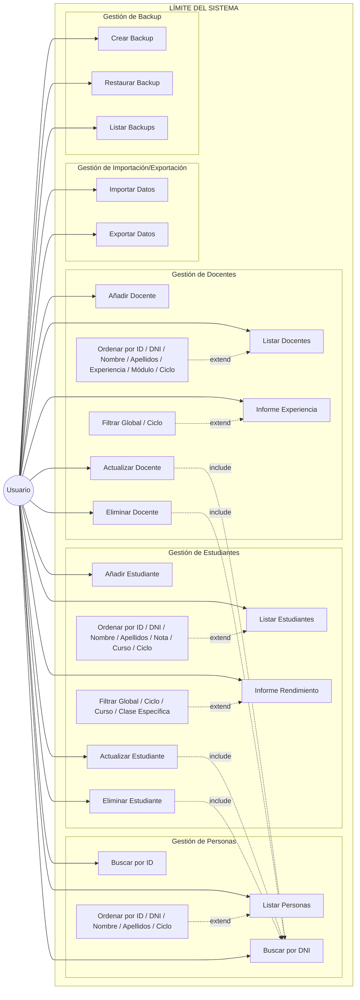

#### Leyenda

| Elemento           | Descripción                                      |
| ------------------ | ------------------------------------------------ |
| **(Usuario)**      | Actor externo al sistema                         |
| **Rectángulos**    | Casos de uso del sistema                         |
| **→**              | Association (línea continua)                     |
| **-. include .->** | Include - relación obligatoria (base → incluido) |
| **<-. extend .-**  | Extend - relación opcional (extendido → base)    |

#### Descripción de las Relaciones

**Include (línea discontinua):**
- `Actualizar Estudiante` → `Buscar DNI`: Para modificar, primero debe localizarse.
- `Eliminar Estudiante` → `Buscar DNI`: Para eliminar, primero debe localizarse.
- `Actualizar Docente` → `Buscar DNI`: Para modificar, primero debe localizarse.
- `Eliminar Docente` → `Buscar DNI`: Para eliminar, primero debe localizarse.

**Extend (línea discontinua):**
- Los listados pueden extenderse con criterios de ordenación.
- Los informes pueden extenderse con filtros por ciclo/curso.

---

**Parametrizaciones de Ordenación (Extend):**

| Listado                | Criterios de ordenación disponibles                    |
| ---------------------- | ------------------------------------------------------ |
| **Listar Personas**    | ID, DNI, Nombre, Apellidos, Ciclo                      |
| **Listar Estudiantes** | ID, DNI, Nombre, Apellidos, Nota, Curso, Ciclo         |
| **Listar Docentes**    | ID, DNI, Nombre, Apellidos, Experiencia, Módulo, Ciclo |

---

**Parametrizaciones de Informes (Extend):**

| Informe                 | Niveles de filtrado disponibles                |
| ----------------------- | ---------------------------------------------- |
| **Informe Estudiantes** | Global, Por Ciclo, Por Curso, Clase Específica |
| **Informe Docentes**    | Global, Por Ciclo                              |

---

## 2. Arquitectura del Sistema (Capas)
El proyecto implementa una **Arquitectura en Capas** (N-Tier Architecture) con un flujo de control unidireccional, lo que garantiza que el sistema sea modular y escalable.

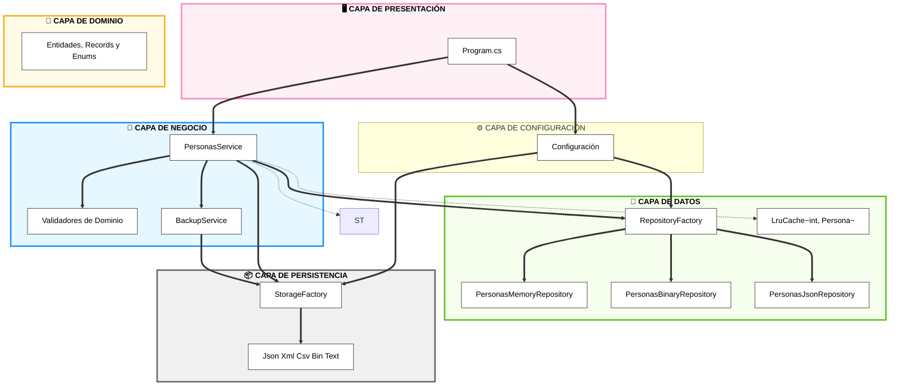

### Responsabilidades Detalladas:

#### 🖥️ Program (`Program.cs`)
Es el **"Camarero"** del sistema. Su única misión es atender al usuario.
*   **Interfaz de Usuario:** Gestiona menús, colores y formato de tablas.
*   **Sanitización de Entrada:** Usa **Regex** para asegurar que el usuario no introduce basura.
*   **Gestión de Excepciones:** Atrapa los errores que suben de las capas inferiores y los muestra de forma amigable.
*   **Configuración de Caché:** Crea e inyecta la caché LRU con capacidad configurable.

#### 🛡️ Validator (`Validators/`)
Es la **"Aduana"** del sistema. No deja pasar ningún objeto que no cumpla las leyes.
*   **Reglas de Integridad:** Aquí se decide qué es un DNI válido, que la nota sea 0-10 o que un docente tenga experiencia coherente.
*   **Desacoplamiento:** El Servicio no sabe *cómo* se valida, solo sabe que el Validador le da el "visto bueno".

#### 🧠 Service (`PersonasService`)
Es el **"Chef"** o cerebro. Orquesta todo el proceso.
*   **Coordinación:** Decide cuándo validar y cuándo guardar.
*   **Transformación de Datos:** Crea los informes estadísticos.
*   **Caché LRU:** Implementa el patrón **Look-Aside**: primero consulta la caché, si no está, va al repositorio y lo guarda en caché.

#### 💾 Repository (`Repositories/`)
Es la **"Despensa"**. Gestión lógica y física de los registros.
*   **Estrategia en Memoria:** Almacena los objetos en estructuras `Dictionary` para búsquedas O(1).
*   **Estrategia Binaria:** Implementa un motor de acceso aleatorio sobre archivos `.dat`, utilizando índices en memoria para garantizar rendimiento O(1) sin cargar todo el archivo.
*   **Estrategia JSON:** Persiste los datos en un archivo JSON, guardando automáticamente tras cada operación.
*   **Gestión de Identidad:** Asigna los identificadores únicos (IDs), gestiona marcas de tiempo y el estado del ciclo de vida (Activo/Baja).
*   **Factory Pattern:** El `RepositoryFactory` crea el repositorio adecuado según la configuración (`appsettings.json`).

#### 💾 BackupService (`Services/Backup/`)
Es el **"Guardián"** de las copias de seguridad. Gestiona la creación y restauración de backups.
*   **Creación de Backup:** Extrae datos del repositorio, los serializa en formato configurable (JSON por defecto) y los comprime en un archivo ZIP.
*   **Restauración:** Extrae el archivo ZIP, carga los datos y los inserta en el repositorio替换ando los existentes.
*   **Gestión de Archivos:** Utiliza el directorio configurado en `appsettings.json` para almacenar los archivos ZIP.

#### ⚙️ Configuración (`Config/`)
Es el **"Panel de Control"**. Lee y centraliza todas las configuraciones del sistema.
*   **appsettings.json:** Archivo externo que define el tipo de repositorio, storage, backup y otros parámetros.
*   **RepositoryFactory:** Utiliza esta configuración para instanciar el repositorio correcto en tiempo de ejecución.
*   **Validación:** Los valores no reconocidos se sustituyen por valores por defecto seguros.


#### ⚡ Cache (`LruCache<TKey, TValue>`)
Es el **"buffer de acceso rápido"**. Optimiza las lecturas frecuentes.
*   **Algoritmo LRU:** Least Recently Used - elimina el elemento menos usado cuando se alcanza la capacidad.
*   **O(1) en operaciones:** Gracias a `Dictionary` + `LinkedList`.
*   **Logging:** Registra HIT/MISS y evictions para facilitar el aprendizaje.

#### 📦 Storage (`Storage/*`)
Es el el **"Archivo"** del sistema. Gestiona la persistencia en diferentes formatos.
*   **Interfaz Común:** Usa `IStorage<T>` para abstraer el formato de archivo.
*   **Factory Pattern:** `StorageFactory` crea el storage correcto según configuración (`appsettings.json`).
*   **Formatos Soportados:** JSON, XML, CSV, CSV-Alt, Texto y Binario.
*   **Serialización:** Convierte modelos a DTOs antes de guardar y viceversa.
*   **Estrategias de Lectura:**
    *   **JSON/XML:** Serialización automática con bibliotecas nativas.
    *   **CSV/Texto:** Parsing manual con `string.Split()`.
    *   **Binario:** `BinaryWriter`/`BinaryReader` campo a campo con count al inicio.

---

## 3. Gestión de Errores: Excepciones de Dominio
El sistema no utiliza errores genéricos, sino que define sus propias **Excepciones de Dominio**. Esto permite una comunicación precisa y profesional entre las capas.

### Jerarquía de Excepciones
Utilizamos clases anidadas para agrupar errores bajo un mismo contexto semántico (`PersonasException`).

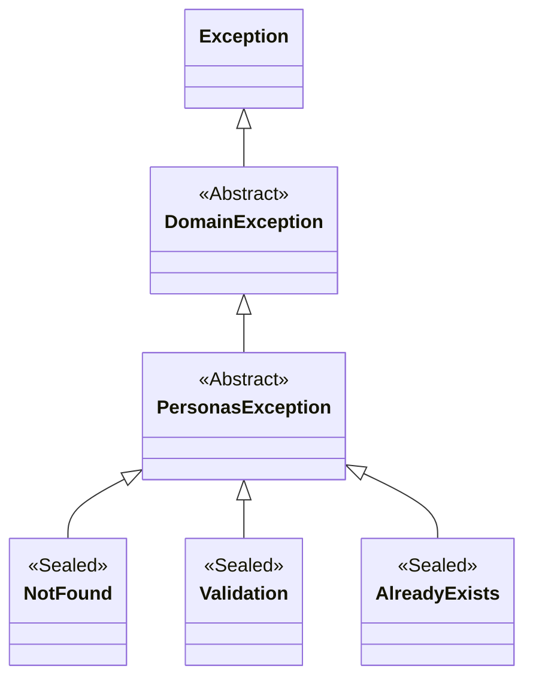

### ¿Por qué usamos Excepciones Personalizadas?
1.  **Semántica Clara:** Es mucho más descriptivo capturar un `NotFound` que un error genérico.
2.  **Desacoplamiento:** La Capa de Presentación no necesita conocer detalles técnicos.
3.  **Seguridad de Datos:** Las excepciones de validación transportan una **lista de errores**.

---

## 4. Diagrama de Clases del Modelo (Detalle Completo)
El modelo de datos refleja fielmente la realidad académica, separando las capacidades mediante interfaces.

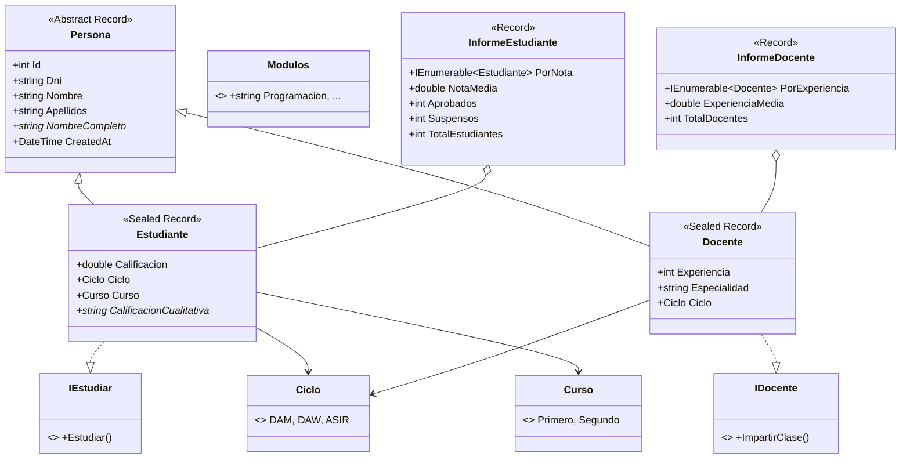

---

## 5. IEnumerable: El Contrato de Solo Lectura
El sistema usa `IEnumerable<T>` como tipo de retorno en las consultas. Este es el contrato más simple posible: "te doy los datos, tú iteras".

### ¿Por qué IEnumerable y no IList o ILista?

| Interfaz         | Características                | Uso                   |
| ---------------- | ------------------------------ | --------------------- |
| `IEnumerable<T>` | Solo iteración, sin Add/Remove | Contrato de consulta  |
| `IList<T>`       | Add, Remove, Index             | Modificación de lista |
| `ILista<T>`      | Tu implementación propia       | Estructura de datos   |

```csharp
// El Repository devuelve IEnumerable - el llamador decide qué hacer
public IEnumerable<Persona> GetAll() => _diccionario.Values;

// El Servicio lo transforma con filtros y ordenación
var resultado = repository.GetAll()
    .Where(p => p.Ciclo == Ciclo.DAW)
    .OrderBy(p => p.Nombre);
```

**Ventajas de IEnumerable:**
1. **Desacoplamiento:** El Repository no impone cómo se usa el resultado.
2. **Flexibilidad:** El caller puede convertir a lista, array, o iterar directamente.
3. **LINQ:** IEnumerable es la base de todas las operaciones LINQ (Where, OrderBy, etc.).
4. **Lazy Evaluation:** Permite procesar grandes conjuntos de datos sin cargar todo en memoria.

---

## 6. El Servicio: Motor de Inteligencia y Consultas
El `Service` no es un simple intermediario; es el **motor de orquestación** donde las reglas del mundo real se convierten en código. Su misión es transformar colecciones de datos en información estratégica.

### 6.1. Inyección de Dependencias
El Servicio recibe sus dependencias desde el exterior (Program.cs), lo que facilita el testing y el cambio de implementaciones.

```csharp
public class PersonasService(
    IPersonasRepository repository,
    IValidador<Persona> valEstudiante,
    IValidador<Persona> valDocente,
    ICache<int, Persona> cache) : IPersonasService
```

### 6.2. El Hub Central: GetAllOrderBy
Centraliza toda la lógica de ordenación del sistema usando un **Diccionario de Estrategias**.

#### 6.2.1. ¿Qué es el Patrón Strategy?
El Patrón Strategy es un patrón de diseño comportamental que permite seleccionar un algoritmo en tiempo de ejecución. En lugar de usar un gran `switch` o múltiples `if/else`, definimos cada algoritmo (estrategia) como una función y las almacenamos en un diccionario.

```csharp
// DICCIONARIO DE ESTRATEGIAS
// ==========================
// Clave: TipoOrdenamiento (enum con los criterios disponibles)
// Valor: Func<IOrderedEnumerable<Persona>> (una función que devuelve una colección ordenada)

var comparadores = new Dictionary<TipoOrdenamiento, Func<IOrderedEnumerable<Persona>>> {
    { TipoOrdenamiento.Id, () => lista.OrderBy(p => p.Id) },
    { TipoOrdenamiento.Dni, () => lista.OrderBy(p => p.Dni) },
    // ... más estrategias
};
```

#### 6.2.2. ¿Por qué usar un diccionario y no un switch?

| Enfoque                        | Ventajas                                | Inconvenientes                               |
| ------------------------------ | --------------------------------------- | -------------------------------------------- |
| **switch tradicional**         | Familiar, fácil de entender             | Cada caso nuevo requiere modificar el switch |
| **Diccionario de estrategias** | Abierto/Cerrado (Open/Closed Principle) | Menos intuitivo inicialmente                 |

**El switch tradicional:**
```csharp
// PROBLEMA: Si quieres añadir un nuevo criterio, aquí
return orden switch {
    TipoOrdenamiento.Id => lista.OrderBy(p => p.Id),
    TipoOrdenamiento.Dni => lista.OrderBy(p => p.Dni),
    // ... 10 casos después
    _ => lista.OrderBy(p => p.Id)
};
```

**El diccionario de estrategias:**
```csharp
// SOLUCIÓN: Añadir un criterio es añadir UNA LÍNEA al diccionario
// sin tocar el resto del código (Open/Closed Principle)
var comparadores = new Dictionary<...> {
    { TipoOrdenamiento.Id, () => lista.OrderBy(p => p.Id) },
    { TipoOrdenamiento.Dni, () => lista.OrderBy(p => p.Dni) },
    { TipoOrdenamiento.Nombre, () => lista.OrderBy(p => p.Nombre) },
    { TipoOrdenamiento.Edad, () => lista.OrderBy(p => p.Edad) }, // Nueva línea
};
```

#### 6.2.3. La magia de TryGetValue
Una vez definidas las estrategias, la ejecución es trivial:

```csharp
// TryGetValue: busca la clave en el diccionario
// Si existe, ejecuta la función asociada
// Si no existe, usa el fallback (orden por ID)

return comparadores.TryGetValue(orden, out var comparador)
    ? comparador()      // Ejecutar la estrategia encontrada
    : lista.OrderBy(p => p.Id);  // Fallback seguro
```

**¿Por qué TryGetValue?**
- Evita excepciones si la clave no existe
- Devuelve el valor directamente en el parámetro `out`
- Más eficiente que verificar `ContainsKey` + acceder

#### 6.2.4. Pattern Matching en propiedades polimórficas
Algunos criterios (Nota, Experiencia) solo aplican a ciertos tipos. Usamos pattern matching para manejar esto de forma segura:

```csharp
{ TipoOrdenamiento.Nota, () => lista.OrderByDescending(p => 
    p is Estudiante e ? e.Calificacion : -1) },
```

**Desglose:**
1. `p is Estudiante e` - ¿Es Estudiante? Si sí, guarda en `e`
2. `e.Calificacion` - Accedemos a la propiedad del tipo derivado
3. `: -1` - Si no es Estudiante, devolvemos -1 (va al final)

**Ventajas:**
- **Seguridad de tipos:** El compilador garantiza que solo accedemos a propiedades válidas
- **Legibilidad:** El código dice claramente qué queremos hacer
- **Flexibilidad:** Se ordena correctamente cada tipo

```csharp
// RESULTADO:
// Estudiantes: ordenados por nota (9, 8, 7, ...)
// Docentes: aparecen al final con valor -1
```

#### 6.2.5. Código completo del Hub

```csharp
public IEnumerable<Persona> GetAllOrderBy(
    TipoOrdenamiento orden = TipoOrdenamiento.Dni,
    Predicate<Persona>? filtro = null)
{
    // PASO 1: Obtener datos del repositorio
    var lista = filtro == null
        ? repository.GetAll()
        : repository.GetAll().Where(p => filtro(p));

    // PASO 2: Definir estrategias de ordenación
    var comparadores = new Dictionary<TipoOrdenamiento, Func<IOrderedEnumerable<Persona>>> {
        { TipoOrdenamiento.Id, () => lista.OrderBy(p => p.Id) },
        { TipoOrdenamiento.Dni, () => lista.OrderBy(p => p.Dni) },
        { TipoOrdenamiento.Nombre, () => lista.OrderBy(p => p.Nombre) },
        { TipoOrdenamiento.Apellidos, () => lista.OrderBy(p => p.Apellidos) },
        { TipoOrdenamiento.Ciclo, () => lista.OrderBy(p => ObtenerCicloTexto(p)) },
        { TipoOrdenamiento.Nota, () => lista.OrderByDescending(p => 
            p is Estudiante e ? e.Calificacion : -1) },
        { TipoOrdenamiento.Experiencia, () => lista.OrderByDescending(p => 
            p is Docente d ? d.Experiencia : -1) },
        { TipoOrdenamiento.Curso, () => lista.OrderBy(p => 
            p is Estudiante e ? (int)e.Curso : int.MaxValue) },
    };

    // PASO 3: Ejecutar la estrategia seleccionada
    return comparadores.TryGetValue(orden, out var comparador)
        ? comparador()
        : lista.OrderBy(p => p.Id);  // Fallback por seguridad
}
```

**Ventajas del patrón Strategy:**
1. **Open/Closed Principle:** Añadir criterios sin modificar código existente
2. **Desacoplamiento:** Cada estrategia es independiente
3. **Testeabilidad:** Cada estrategia se puede probar aisladamente
4. **Legibilidad:** Toda la lógica de ordenación en un solo lugar

### 6.3. Generación de Informes
Los informes se construyen aplicando filtros y calculando métricas.

```csharp
public InformeEstudiante GenerarInformeEstudiante(Ciclo? ciclo, Curso? curso) {
    var estudiantes = GetEstudiantesOrderBy(TipoOrdenamiento.Nota)
        .Where(e => (ciclo == null || e.Ciclo == ciclo) && 
                    (curso == null || e.Curso == curso))
        .ToList();

    var total = estudiantes.Count;
    if (total == 0) return new InformeEstudiante();

    return new InformeEstudiante {
        PorNota = estudiantes,
        TotalEstudiantes = total,
        Aprobados = estudiantes.Count(e => e.Calificacion >= 5.0),
        Suspensos = estudiantes.Count(e => e.Calificacion < 5.0),
        NotaMedia = estudiantes.Average(e => e.Calificacion)
    };
}
```

**Nota sobre `.ToList()`:** Se materializa el IEnumerable en una lista para poder contar varias veces (Aprobados, Suspensos) sin iterar múltiples veces sobre la colección.

---

## 7. Análisis de Principios SOLID y DRY
Has aplicado los estándares de la industria para garantizar que el código sea mantenible, escalable y fácil de entender.

### 📐 Principios SOLID

#### **S - Single Responsibility (Responsabilidad Única)**
Cada clase tiene una única misión. Por ejemplo, el `ValidadorEstudiante` solo se encarga de las reglas de integridad, sin saber nada de menús o de cómo se guardan los datos.

```csharp
// El validador solo valida, no persiste ni imprime
public class ValidadorEstudiante : IValidador<Persona> {
    public IEnumerable<string> Validar(Persona persona) {
        var errores = new List<string>();
        if (persona is not Estudiante estudiante) {
            errores.Add("La entidad no es un Estudiante.");
            return errores;
        }
        if (estudiante.Calificacion is < 0 or > 10)
            errores.Add("La calificación debe estar entre 0.0 y 10.0.");
        // ...
        return errores;
    }
}
```

#### **O - Open/Closed (Abierto/Cerrado)**
El sistema permite añadir funcionalidades nuevas (extender) sin modificar el código que ya funciona. Lo logras mediante **inversión de dependencias**.

```csharp
// GetAllOrderBy usa un diccionario de estrategias.
// Para añadir un nuevo criterio, solo añaden una línea al mapa:
{ TipoOrdenamiento.Edad, () => lista.OrderBy(p => p.Edad) }
```

#### **L - Liskov Substitution (Sustitución de Liskov)**
El repositorio almacena `Persona` (clase base), pero el programa funciona perfectamente inyectando `Estudiante` o `Docente`. La clase base es totalmente sustituible por sus hijas.

```csharp
// El repositorio acepta cualquier subtipo de Persona
_diccionario[id] = new Estudiante { ... };
_diccionario[id] = new Docente { ... };
```

#### **I - Interface Segregation (Segregación de Interfaces)**
No has creado una interfaz gigantesca. Has separado las capacidades: `IEstudiar` para alumnos e `IDocente` para profesores.

```csharp
public sealed record Estudiante : Persona, IEstudiar { ... }
public sealed record Docente : Persona, IDocente { ... }
```

#### **D - Dependency Inversion (Inversión de Dependencias)**
El `Service` no depende de implementaciones concretas, sino de sus **Interfaces**. Esto permite cambiar el almacenamiento o añadir caché sin tocar la lógica de negocio.

```csharp
public class PersonasService(
    IPersonasRepository repository,
    IValidador<Persona> valEstudiante,
    IValidador<Persona> valDocente,
    ICache<int, Persona> cache)
```

---

### 💧 Principio DRY (Don't Repeat Yourself)
Has evitado la repetición de lógica mediante:

1.  **Motor de Consultas Unificado:** Un único `GetAllOrderBy` con Dictionary de estrategias.
2.  **Validación Polimórfica:** Un solo método `ValidarPersonaConLogicaPolimorfica` que selecciona el validador correcto según el tipo.

```csharp
// Un solo método maneja todos los tipos de Persona
private void ValidarPersonaConLogicaPolimorfica(Persona persona) {
    var errores = persona switch {
        Estudiante => valEstudiante.Validar(persona),
        Docente => valDocente.Validar(persona),
        _ => ["Tipo no soportado."]
    };
    // ...
}
```

---

## 8. Caché LRU: Optimización de Lecturas
El sistema implementa una caché **LRU (Least Recently Used)** para optimizar las lecturas por ID.

### 8.1. ¿Qué es LRU?
LRU significa "Least Recently Used" (Menos Recientemente Usado). Cuando la caché está llena y se necesita añadir un nuevo elemento, se elimina el que lleva más tiempo sin ser accedido.

### 8.2. Estructura de la Caché

```csharp
public class LruCache<TKey, TValue> : ICache<TKey, TValue> where TKey : notnull {
    private readonly Dictionary<TKey, TValue> _data = new();      // O(1) búsqueda
    private readonly LinkedList<TKey> _usageOrder = new();       // Orden de uso
    private readonly int _capacity;                               // Capacidad máxima

    public LruCache(int capacity) {
        if (capacity <= 0)
            throw new ArgumentException("La capacidad debe ser mayor que 0.");
        _capacity = capacity;
    }
}
```

**¿Por qué dos estructuras?**
- `Dictionary`: Permite buscar cualquier elemento en O(1).
- `LinkedList`: Mantiene el orden de uso. El primer nodo (`First`) es el menos usado; el último (`Last`) es el más reciente.

### 8.3. Operaciones de la Caché

```csharp
// AÑADIR (Add)
public void Add(TKey key, TValue value) {
    if (_data.TryGetValue(key, out _)) {
        RefreshUsage(key); // Ya existe, actualizar y mover al final
        return;
    }

    if (_data.Count >= _capacity) {
        // Caché llena: eliminar el menos usado (First de la lista)
        var oldestKey = _usageOrder.First!.Value;
        _usageOrder.RemoveFirst();
        _data.Remove(oldestKey);
    }

    _data.Add(key, value);
    _usageOrder.AddLast(key);
}

// OBTENER (Get)
public TValue? Get(TKey key) {
    if (!_data.TryGetValue(key, out var value)) return default;
    RefreshUsage(key); // "Rejuvenecer" el elemento
    return value;
}

// REFRESCAR USO (RefreshUsage)
private void RefreshUsage(TKey key) {
    _usageOrder.Remove(key);  // Sacar de donde esté
    _usageOrder.AddLast(key); // Poner como el más reciente
}
```

### 8.4. Patrón Look-Aside en el Servicio
El Servicio implementa el patrón **Look-Aside** para la caché:

```csharp
public Persona GetById(int id) {
    var cached = cache.Get(id);
    if (cached != null) return cached;  // HIT: está en caché

    var persona = repository.GetById(id) ?? throw new PersonasException.NotFound(id.ToString());
    cache.Add(id, persona);  // MISS: añadir a caché
    return persona;
}
```

### 8.5. Estrategias de Caché en Operaciones CRUD

| Operación    | Estrategia             | Código                                     |
| ------------ | ---------------------- | ------------------------------------------ |
| **Create**   | Añadir                 | `cache.Add(id, persona)`                   |
| **Update**   | Invalidar              | `cache.Remove(id)`                         |
| **Delete**   | Invalidar              | `cache.Remove(id)`                         |
| **GetById**  | Look-Aside             | `cache.Get()` → repository → `cache.Add()` |
| **GetByDni** | Añadir (tenemos el ID) | `cache.Add(persona.Id, persona)`           |

**Nota pedagógica:** En producción, Create normalmente NO añade a caché (se repoblará en el primer GetById). Aquí lo hacemos para que veáis el funcionamiento.

### 8.6. Complejidad Algorítmica

| Operación      | Complejidad     |
| -------------- | --------------- |
| `Add`          | O(1) amortizado |
| `Get`          | O(1)            |
| `Remove`       | O(1)            |
| `RefreshUsage` | O(1)            |

---

## 9. Sistema de Repositorios (Repository)
El sistema implementa una **capa de datos** flexible que permite persistir los datos de diferentes maneras. A diferencia del Storage (que es para Import/Export), el Repository gestiona la persistencia principal del sistema entre ejecuciones.

### 9.1. Interfaz Común: IPersonasRepository
Todos los repositorios implementan una interfaz común que define el contrato CRUD:

```csharp
public interface IPersonasRepository : ICrudRepository<int, Persona> {
    Persona? GetByDni(string dni);
    bool ExisteDni(string dni);
    bool DeleteAll();
}
```

**Patrón Singleton:** Todos los repositorios usan `Lazy<T>` para garantizar una sola instancia en memoria.

### 9.2. Factory Pattern: RepositoryFactory
El patrón Factory crea el repositorio adecuado según la configuración de `appsettings.json`:

```csharp
public static class RepositoryFactory {
    public static IPersonasRepository GetRepository(RepositoryType type) {
        return type switch {
            RepositoryType.Memory => PersonasMemoryRepository.Instance,
            RepositoryType.Binary => PersonasBinaryRepository.Instance,
            RepositoryType.Json => PersonasJsonRepository.Instance,
            _ => throw new ArgumentException(...)
        };
    }

    public static IPersonasRepository GetDefaultRepository(string configType) {
        var type = configType.ToLower() switch {
            "memory" => RepositoryType.Memory,
            "binary" => RepositoryType.Binary,
            "json" => RepositoryType.Json,
            _ => throw new ArgumentException(...)
        };
        return GetRepository(type);
    }
}
```

**Ventajas:**
- **Inversión de Dependencias:** El código cliente no depende de implementaciones concretas.
- **Configuración Externa:** El tipo de repositorio se define en `appsettings.json`.
- **Extensibilidad:** Añadir nuevos tipos de repositorio sin modificar código existente.

### 9.3. Tipos de Repositorio Disponibles

| Tipo | Clase | Persistencia | Uso |
|------|-------|--------------|-----|
| **Memory** | PersonasMemoryRepository | Dictionary en RAM (volátil) | Desarrollo, testing |
| **Binary** | PersonasBinaryRepository | Archivos binarios (.dat, .idx, .frag) | Producción con alto rendimiento |
| **Json** | PersonasJsonRepository | Archivo JSON (academia.json) | Producción simple |

### 9.4. Repositorio en Memoria (Memory)
El repositorio más simple. Almacena todos los datos en un `Dictionary<int, Persona>` en memoria RAM.
- **Ventaja:** Máxima velocidad de acceso O(1).
- **Inconveniente:** Los datos se pierden al cerrar la aplicación.

### 9.5. Repositorio Binario (Binary)
Implementa un motor de base de datos simplificado con acceso aleatorio:
- **Archivos:** `.dat` (datos), `.idx` (índices), `.frag` (fragmentación).
- **Índices:** Mantiene diccionarios en memoria para búsquedas O(1).
- **Gestión de Huecos:** Reutiliza espacio de registros eliminados (First Fit).
- **Ventaja:** Persistencia duradera con alto rendimiento.

### 9.6. Repositorio JSON (Json)
Persiste los datos en un archivo JSON:
- **Archivo:** `data/academia.json`
- **Persistencia:** Guarda automáticamente tras cada operación (Create, Update, Delete).
- **Ventaja:** Formato legible, fácil de depurar, estándar.

---

## 10. Sistema de Almacenamiento (Storage)
El sistema implementa una **capa de persistencia** flexible que permite almacenar y recuperar datos en múltiples formatos. Esta separación permite cambiar el formato de almacenamiento sin modificar la lógica de negocio.

### 9.1. Interfaz Común: IStorage<T>
Todos los storages implementan una interfaz común que define el contrato de persistencia:

```csharp
public interface IStorage<T> {
    void Salvar(IEnumerable<T> items, string path);
    IEnumerable<T> Cargar(string path);
}
```

**Ventajas:**
- **Desacoplamiento:** El servicio no conoce el formato concreto.
- **Extensibilidad:** Añadir nuevos formatos sin modificar código existente.
- **Testabilidad:** Se pueden crear storages mock para testing.

### 9.2. Factory Pattern: StorageFactory
El patrón Factory crea el storage adecuado según la configuración:

```csharp
public static IStorage<Persona> GetDefaultStorage(string configType) {
    var type = configType.ToLower() switch {
        "txt" or "text" => StorageType.Text,
        "csv" => StorageType.Csv,
        "json" => StorageType.Json,
        "xml" => StorageType.Xml,
        "bin" => StorageType.Bin,
        _ => throw new ArgumentException(...)
    };
    return GetStorage(type);
}
```

### 9.3. Formatos de Almacenamiento

| Formato     | Clase                 | Biblioteca          | Extensión | Ventajas                  |
| ----------- | --------------------- | ------------------- | --------- | ------------------------- |
| **JSON**    | AcademiaJsonStorage   | System.Text.Json    | .json     | Estándar moderno, legible |
| **XML**     | AcademiaXmlStorage    | System.Xml          | .xml      | Jerárquico, validable     |
| **CSV**     | AcademiaCsvStorage    | Manual              | .csv      | Universal, ligero         |
| **CSV-Alt** | AcademiaCsvAltStorage | CsvHelper           | .csv      | Robusto, menos código     |
| **Texto**   | AcademiaTextStorage   | Manual              | .txt      | Formato propietario       |
| **Binario** | AcademiaBinStorage    | BinaryWriter/Reader | .bin      | Máximo rendimiento        |

### 9.4. Serialización Binaria (.bin)
El almacenamiento binario secuencial (usado para exportación/importación) implementa lectura/escritura campo a campo de toda la colección:

```csharp
// ESCRIBIR: Cabecera con count + registros
writer.Write(dtos.Count);
foreach (var dto in dtos) {
    writer.Write(dto.Id);
    writer.Write(dto.Dni);
    // ... 13 campos por registro
}

// LEER: Leer count y luego ese número de registros
var total = reader.ReadInt32();
for (int i = 0; i < total; i++) {
    var dto = new PersonaDto(...);
}
```

**Ventajas:**
- Tamaño mínimo (no hay texto, solo bytes)
- Lectura/escritura muy rápida
- Control total sobre el formato

### 9.5. Motor de Persistencia Binaria Avanzado (Repository)
A diferencia de la serialización secuencial, el motor binario del repositorio implementa una gestión de archivos de nivel profesional para permitir acceso aleatorio e integridad:
*   **Separación de Responsabilidades:** Utiliza tres archivos: `.dat` (datos), `.idx` (índices en disco) y `.frag` (mapa de fragmentación).
*   **Gestión de Huecos:** Implementa el algoritmo **First Fit** para reutilizar espacio de registros eliminados físicamente o reubicados.
*   **Proceso de Vacuum:** Permite reescribir el almacén de forma contigua, eliminando toda la fragmentación física y los huecos muertos, pero garantizando la integridad de los registros en borrado lógico (historial).

### 9.6. DTOs y Mapeo
Para separar el modelo de dominio de la persistencia, se usan **DTOs** (Data Transfer Objects). ¿Por qué? Porque el modelo de dominio puede tener lógica, propiedades calculadas o referencias circulares que no son adecuadas para la serialización.

```csharp
public record PersonaDto(
    int Id,
    string Dni,
    string Nombre,
    // ... campos del modelo
);
```

El `PersonaMapper` convierte:
- **Modelo → DTO:** Para guardar (elimina lógica de negocio)
- **DTO → Modelo:** Para cargar (rehidrata objetos)

Usaremos `funciones de extensión` para mantener el código limpio:

```csharp
public static class PersonaMapper {
    public static PersonaDto ToDto(this Persona persona) => new(
        persona.Id,
        persona.Dni,
        persona.Nombre,
        // ...
    );
    public static Persona ToModel(this PersonaDto dto) {
        // Lógica para decidir si es Estudiante o Docente
        if (dto.Curso != null) {
            return new Estudiante(...);
        } else {
            return new Docente(...);
        }
    }
}
```

### 9.6. Lazy Evaluation
Los storages usan `IEnumerable` para evitar cargar todo en memoria. Esto es especialmente importante para formatos como CSV o Texto, donde el parsing es manual y con ello conseguimos eficiencia y escalabilidad.

```csharp
// En AcademiaJsonStorage
return dtos?.Select(dto => dto.ToModel());

// En AcademiaCsvStorage
return File.ReadLines(path)
    .Skip(1)
    .Select(linea => Parsear(linea));
```

### 9.7. Configuración Dinámica
El tipo de storage y repositorio se configuran en `appsettings.json`:

```json
{
  "Storage": {
    "Type": "Json"  // Cambiar a: Xml, Csv, Bin, Text
  },
  "Repository": {
    "Type": "Memory",  // Tipos disponibles: Memory (RAM), Binary (ficheros binarios), Json (fichero JSON)
    "Directory": "data"  // Directorio donde se guardan los datos del repositorio
  },
  "Backup": {
    "Directory": "back",  // Directorio para los archivos ZIP de backup
    "Format": "Json"  // Formato de los datos dentro del ZIP: Json, Xml, Csv, Bin, Text
  },
  "Academica": {
    "NotaAprobado": 5.0
  }
}
```

**Descripción de secciones:**
- **Storage**: Define el formato para operaciones de Import/Export (lectura/escritura de ficheos externos)
- **Repository**: Define el tipo de persistencia del sistema (datos que persisten entre ejecuciones) y su directorio
- **Backup**: Define el directorio y formato para las copias de seguridad ZIP
- **Academica**: Configuración académica como la nota de aprobado

La clase `Configuracion` deduce automáticamente la extensión del archivo.

Para leer la configuración, se puede usar `IConfiguration` de .NET:

```csharp
var config = new ConfigurationBuilder()
    .AddJsonFile("appsettings.json")
    .Build();

var storageType = config["Storage:Type"] ?? "Json";
var storage = StorageFactory.GetDefaultStorage(storageType);
```

---

## 10. Diagramas de Comportamiento
Los diagramas de secuencia muestran el flujo de mensajes entre los componentes para las operaciones clave del sistema. Esto te ayuda a entender cómo se orquesta el código en tiempo de ejecución.

### 10.1. Diagrama de Secuencia: Listar Todo el Personal (Operación READ ALL)

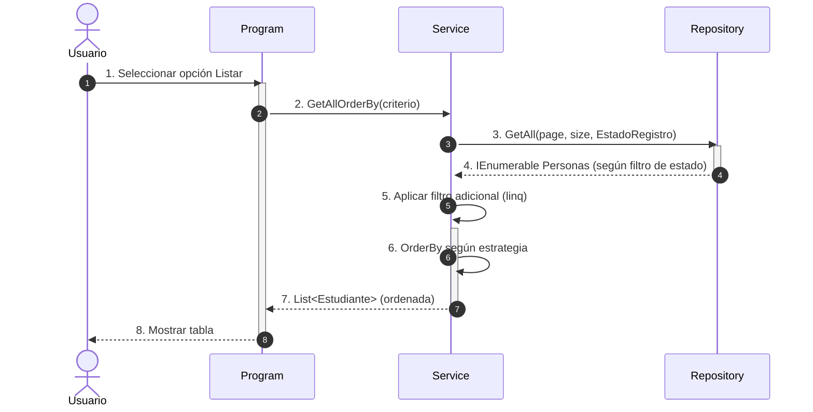

#### Trazabilidad de Código:
*   **[1] Usuario:** Selecciona opción del menú
*   **[2] Program:** `var lista = service.GetAllOrderBy(criterio);`
*   **[3-4] Repository:** `repository.GetAll(page, size, estado)` → Filtro por estado (Todos/Activos/Historial) y paginación.
*   **[5-6] Service:** Aplicar filtro y ordenación con diccionario de estrategias
*   **[7-8] Program:** `ImprimirTablaPersonas(lista)`

---

### 10.2. Diagrama de Secuencia: Buscar por ID (Operación READ ONE con Caché)

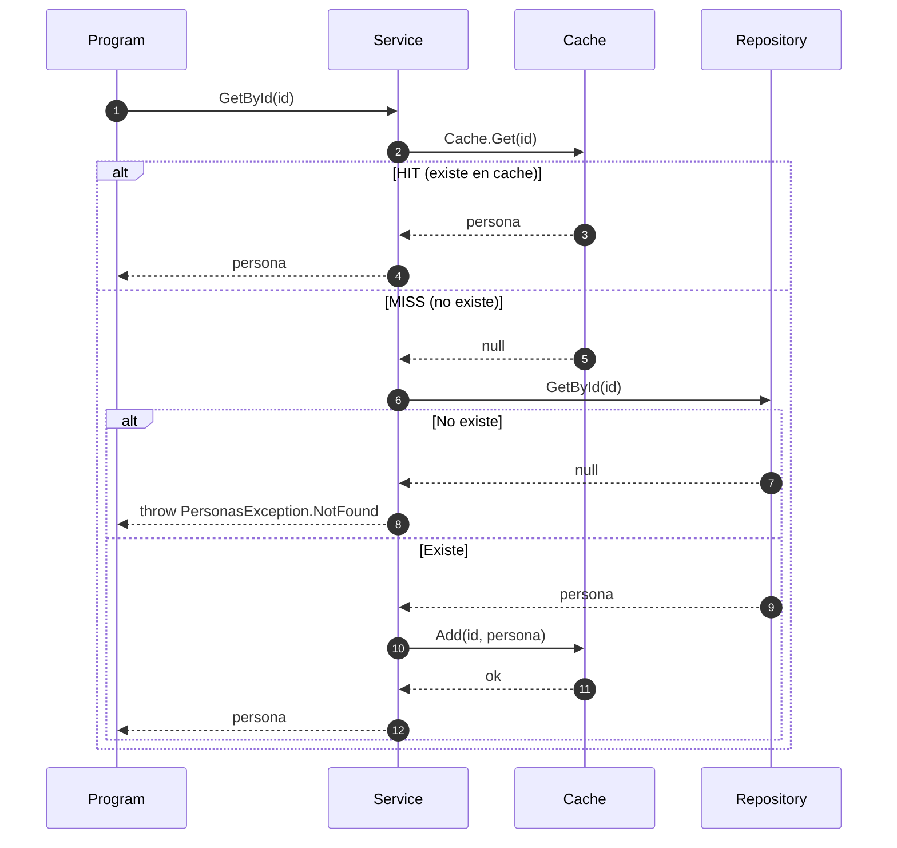

#### Trazabilidad de Código:
*   **[1] Program:** `var p = service.GetById(id);`
*   **[2] Service:** `cache.Get(id)` - Si existe (HIT) devuelve directamente
*   **[3] Cache:** Si no existe (MISS) → `null`
*   **[4] Repository:** `repository.GetById(id)`
*   **[5-6] Repository:** Localiza la entidad mediante ID (O(1) en RAM o índices en Disco).
*   **[7-8] Service:** Si no existe → `throw new PersonasException.NotFound(id)`
*   **[9-10] Cache:** Si existe → `cache.Add(id, persona)` - Se añade tras lectura
*   **[11] Program:** `ImprimirFichaPersona(p)`

---

### 10.3. Diagrama de Secuencia: Crear Estudiante (Operación CREATE)

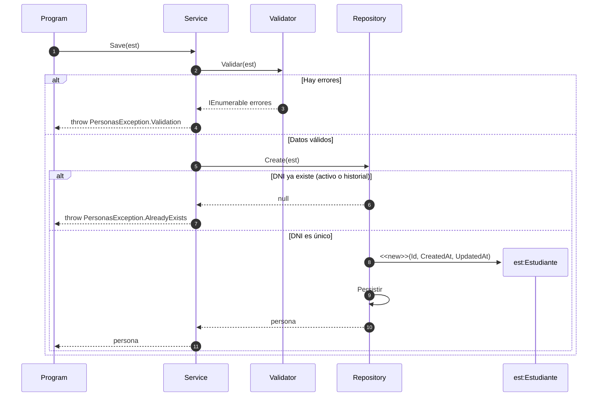

#### Trazabilidad de Código:
*   **[1] Program:** `var creado = service.Save(estudiante);`
*   **[2] Service:** Llama al Validator
*   **[3] Validator:** `valEstudiante.Validar(estudiante)` - Devuelve errores si los hay
*   **[4] Service:** Si hay errores → `throw new PersonasException.Validation(errores)`
*   **[5] Service:** Si válido → `repository.Create(estudiante)`
*   **[6-7] Repository:** Verifica unicidad del DNI en el almacén. Si ya existe (incluso en historial) → lanza conflicto.
*   **[8-10] Repository:** Crea la entidad con nuevo ID y metadatos, persistiendo el cambio físicamente.
*   **[11] Service:** Devuelve la persona creada
*   **[12] Program:** `ImprimirFichaPersona(persona)`

---

### 10.4. Diagrama de Secuencia: Actualizar Estudiante (Operación UPDATE)

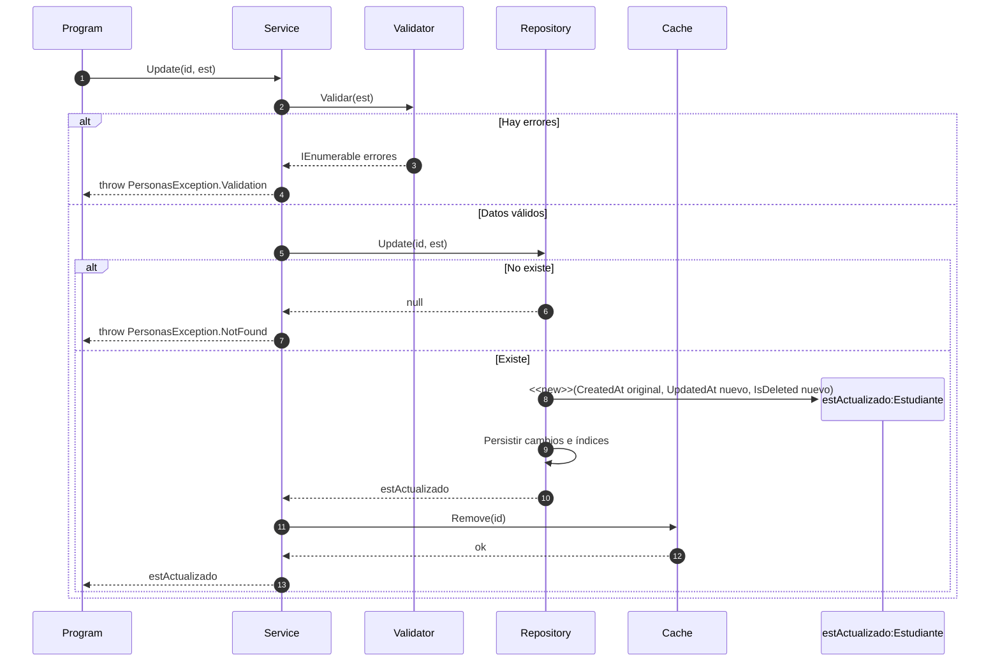

#### Trazabilidad de Código:
*   **[1] Program:** `var actualizado = service.Update(id, estudiante);`
*   **[2] Service:** Llama al Validator
*   **[3] Validator:** `valEstudiante.Validar(estudiante)` - Devuelve errores si los hay
*   **[4] Service:** Si hay errores → `throw new PersonasException.Validation(errores)`
*   **[5] Service:** Si válido → `repository.Update(id, estudiante)`
*   **[6-7] Repository:** Busca la entidad por ID. Si no existe → lanza error de no encontrado.
*   **[8-10] Repository:** Genera la nueva versión del objeto (manteniendo metadatos originales) y persiste los cambios físicos y lógicos (incluyendo historial/DNI).
*   **[11] Service:** `cache.Remove(id)` - Invalida caché
*   **[12] Service:** Devuelve estudiante actualizado
*   **[13] Program:** `ImprimirFichaPersona(actualizado)`

---

### 10.5. Diagrama de Secuencia: Eliminar Estudiante (Operación DELETE)

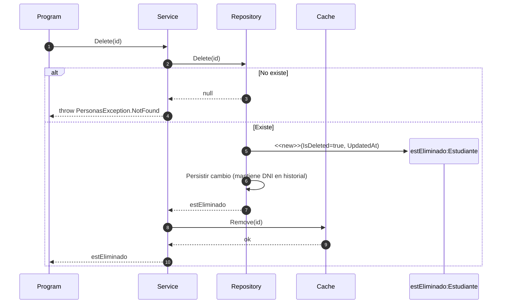

#### Trazabilidad de Código:
*   **[1] Program:** `var eliminado = service.Delete(id);`
*   **[2] Service:** `repository.Delete(id)`
*   **[3-4] Repository:** Busca y valida la existencia del ID. Si no existe → lanza error.
*   **[5-7] Repository:** Marca el registro como `IsDeleted = true`. IMPORTANTE: El DNI permanece en el almacén para detectar futuros conflictos de alta.
*   **[8] Service:** `cache.Remove(id)` - Invalida caché
*   **[9] Service:** Devuelve `estEliminado`
*   **[10] Program:** `ImprimirFichaPersona(eliminado)`


### 10.6. Diagrama de Secuencia: Generar Informe de Rendimiento de Estudiantes (READ con Agregación)

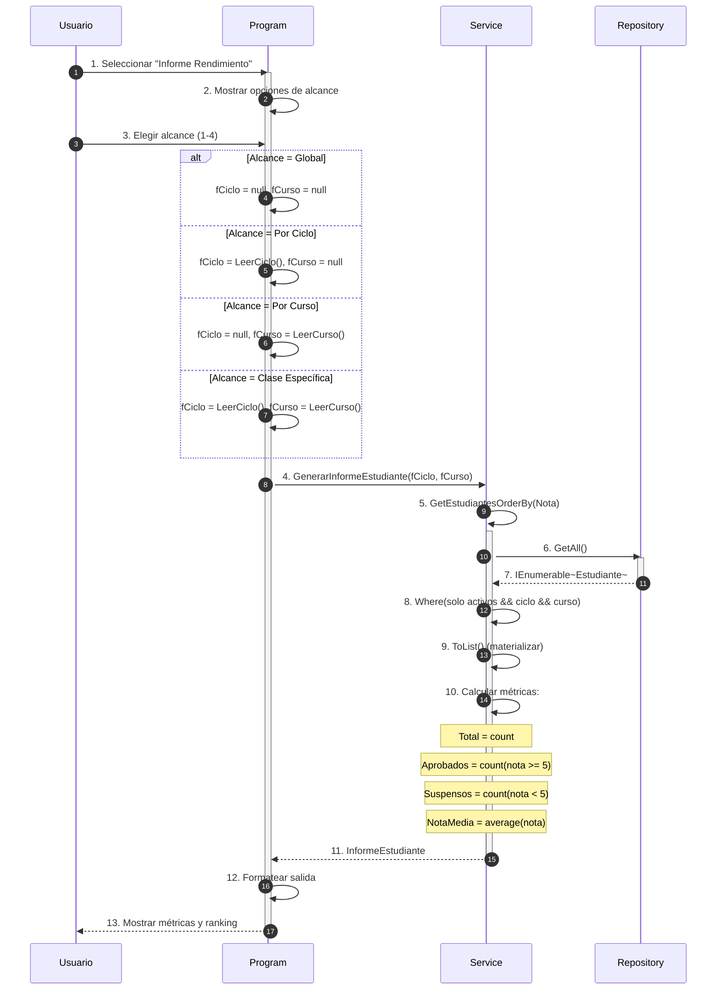

#### Trazabilidad de Código:
*   **[1] Usuario:** Selecciona opción 8 del menú (`OpcionMenu.InformeEstudiantes`)
*   **[2-3] Program:** `MostrarInformeEstudiantes(service)` - Solicita alcance
*   **[4] Program:** `service.GenerarInformeEstudiante(fCiclo, fCurso)` - Pasa filtros
*   **[5-6] Service:** `GetEstudiantesOrderBy(TipoOrdenamiento.Nota)` - Obtiene del repositorio
*   **[7] Repository:** `repository.GetAll()` - Devuelve todos los estudiantes
*   **[8] Service:** `.Where(e => !e.IsDeleted && (ciclo == null || e.Ciclo == ciclo) && ...)` - Filtra solo activos y aplica alcances nulos
*   **[9] Service:** `.ToList()` - Materializa para contar varias veces (LINQ deferred execution)
*   **[10] Service:** Calcula:
    *   `TotalEstudiantes = count`
    *   `Aprobados = count(e => e.Calificacion >= 5.0)`
    *   `Suspensos = count(e => e.Calificacion < 5.0)`
    *   `NotaMedia = average(e => e.Calificacion)`
*   **[11] Service:** Devuelve `InformeEstudiante` con PorNota, Total, Aprobados, Suspensos, NotaMedia
*   **[12-13] Program:** Formatea y muestra tabla con métricas y ranking por nota

#### Punto Clave: Pipeline Funcional con LINQ
El método `GenerarInformeEstudiante` encadena operaciones en una sola expresión fluida:

```csharp
var estudiantes = GetEstudiantesOrderBy(TipoOrdenamiento.Nota)  // Obtener
    .Where(e => !e.IsDeleted)                                    // Solo Activos
    .Where(e => (ciclo == null || e.Ciclo == ciclo) && ...)       // Filtrar Alcance
    .ToList();                                                     // Materializar

return new InformeEstudiante {
    PorNota = estudiantes,
    TotalEstudiantes = estudiantes.Count,
    Aprobados = estudiantes.Count(e => e.Calificacion >= 5.0),
    Suspensos = estudiantes.Count(e => e.Calificacion < 5.0),
    NotaMedia = estudiantes.Average(e => e.Calificacion)
};
```

**Nota sobre `.ToList()`:** Se materializa el IEnumerable en lista para poder:
1. Contar múltiples veces (Aprobados, Suspensos, Total)
2. Calcular la media sin iterar de nuevo
3. Evitar evaluación diferida (deferred execution) en las estadísticas

---

### 10.7. Diagrama de Secuencia: Exportar Datos (Operación EXPORT)

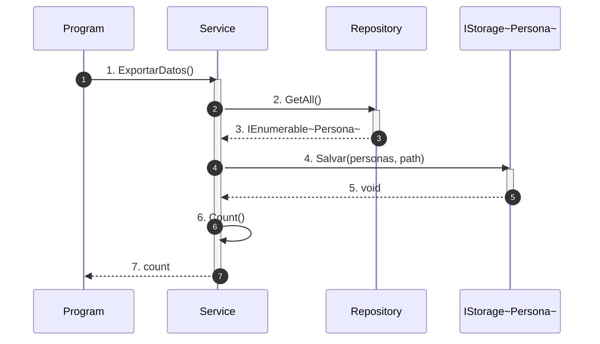

#### Trazabilidad de Código:
*   **[1] Program:** `service.ExportarDatos()`
*   **[2-3] Repository:** `repository.GetAll()` → devuelve IEnumerable de personas
*   **[4-5] Storage:** `storage.Salvar(personas, path)` → guarda en el formato configurado
*   **[6] Service:** `personas.Count()` → obtiene el total de registros exportados
*   **[7] Program:** Devuelve el número de registros al usuario

---

### 10.8. Diagrama de Secuencia: Importar Datos (Operación IMPORT)

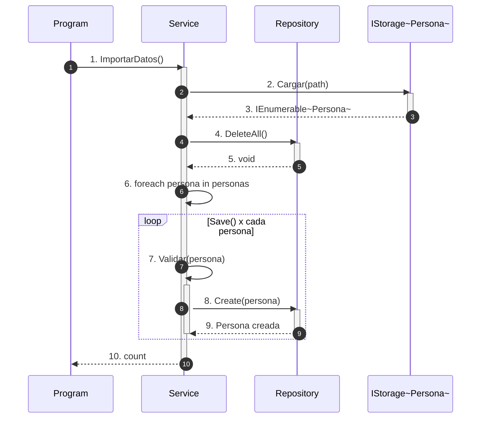

#### Trazabilidad de Código:
*   **[1] Program:** `service.ImportarDatos()`
*   **[2-3] Storage:** `storage.Cargar(path)` → lee del formato configurado
*   **[4-5] Repository:** `repository.DeleteAll()` → elimina todos los datos existentes
*   **[6-9] Service:** `foreach` que itera sobre cada persona:
    *   **[7] Service:** `ValidarPersonaConLogicaPolimorfica(persona)` → valida según tipo
    *   **[8-9] Repository:** `repository.Create(persona)` → crea el registro
*   **[10] Program:** Devuelve el número de registros importados

---

### 10.9. Diagrama de Secuencia: Realizar Backup (Operación BACKUP)

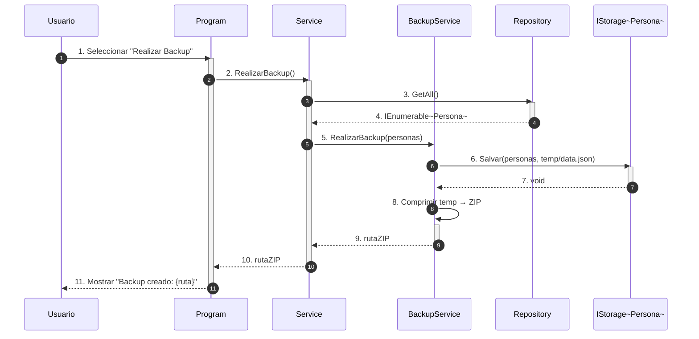

#### Trazabilidad de Código:
*   **[1] Usuario:** Selecciona opción 16 del menú (`OpcionMenu.RealizarBackup`)
*   **[2] Program:** `service.RealizarBackup()`
*   **[3-4] Repository:** `repository.GetAll()` → obtiene todas las personas
*   **[5] Service:** `backupService.RealizarBackup(personas)` → pasa los datos al servicio de backup
*   **[6-7] Storage:** `storage.Salvar(personas, tempPath)` → serializa a JSON/XML/etc en directorio temporal
*   **[8] BackupService:** `ZipFile.CreateFromDirectory()` → comprime a ZIP
*   **[9-10] Service:** Devuelve la ruta del archivo ZIP creado
*   **[11] Program:** Muestra mensaje de éxito con la ruta

**Punto Clave:** El servicio de backup está inyectado en PersonasService, lo que permite cambiar su implementación sin modificar la lógica de negocio.

---

### 10.10. Diagrama de Secuencia: Restaurar Backup (Operación RESTORE)

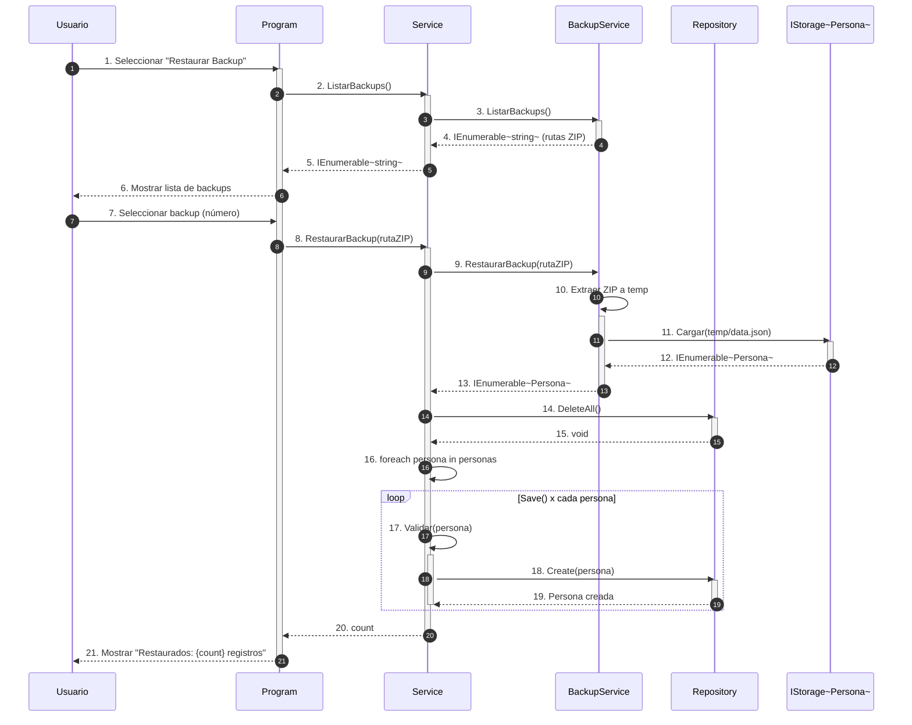

#### Trazabilidad de Código:
*   **[1] Usuario:** Selecciona opción 17 del menú (`OpcionMenu.RestaurarBackup`)
*   **[2-5] Program:** `service.ListarBackups()` → obtiene lista de archivos ZIP disponibles
*   **[6-7] Program:** Muestra la lista y el usuario selecciona uno
*   **[8] Program:** `service.RestaurarBackup(rutaZip)` → pasa la ruta al servicio
*   **[9-13] BackupService:** 
    *   Extrae el ZIP a un directorio temporal
    *   Carga los datos con `storage.Cargar()`
*   **[14-15] Repository:** `repository.DeleteAll()` → elimina todos los datos actuales
*   **[16-19] Service:** `foreach` que itera sobre cada persona restaurada:
    *   Valida la persona según su tipo
    *   Crea el registro en el repositorio
*   **[20-21] Program:** Muestra el número de registros restaurados

**Punto Clave:** La restauración primero limpia el repositorio y luego reinserta todos los datos, manteniendo la lógica de validación del servicio.

---

### 10.11. Diagrama de Actividad: Actualizar Estudiante (UPDATE)

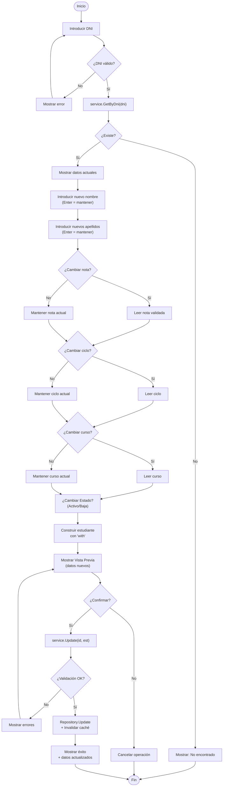

#### Trazabilidad de Código:
*   **[A-H] Validación DNI:** `ValidarDniCompleto(d)` - Validación con algoritmo real
*   **[E-F] Búsqueda:** `service.GetByDni(dni)` → `PersonasException.NotFound`
*   **[I] Mostrar actual:** `ImprimirFichaPersona(est)` - Muestra datos antes de modificar
*   **[J-T] Entrada modular:** Cada campo se pide individualmente con opción de mantener
*   **[U] Constructor with:** `est with { Nombre = ..., Calificacion = ... }` - Inmutabilidad
*   **[V] Preview:** `ImprimirFichaPersona(act)` - Revisión antes de confirmar
*   **[Y] Update:** `service.Update(est.Id, act)` - Lógica de negocio + validación
*   **[Z] Validación:** `valEstudiante.Validar(estudiante)` - Reglas de dominio
*   **[AB] Persistencia:** `repository.Update()` + `cache.Remove(id)` - Caché LRU

---

### 10.12. Diagrama de Estado: Ciclo de Vida del Estudiante

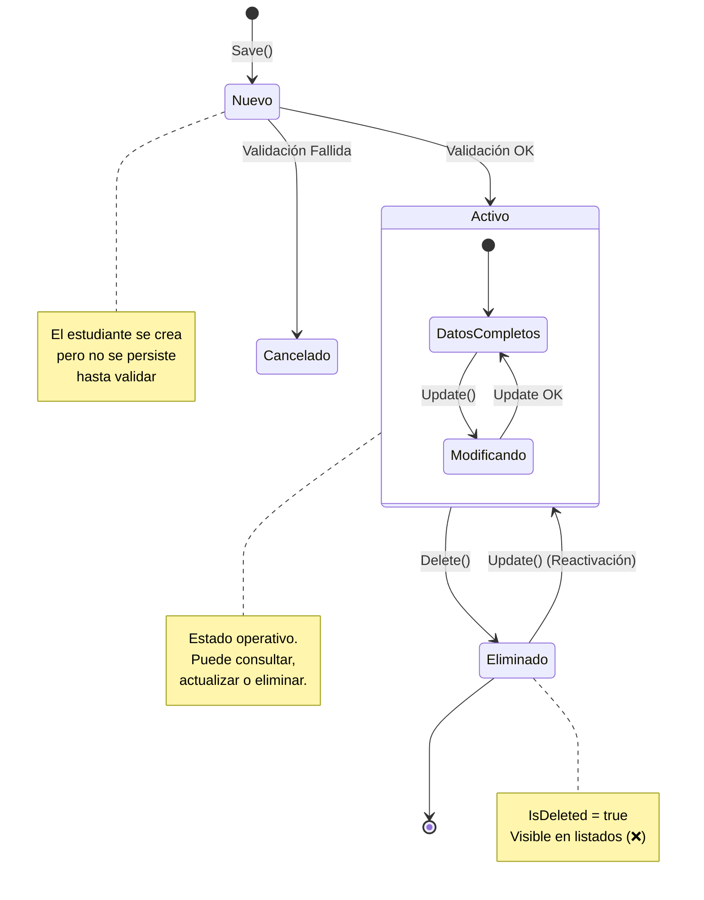

#### Estados del Estudiante:

| Estado          | Descripción                                 | Transiciones                             |
| --------------- | ------------------------------------------- | ---------------------------------------- |
| **Nuevo**       | Estudiante creado en memoria, sin persistir | → Activo (validado), → Cancelado (error) |
| **Activo**      | Estudiante persistido y operativo           | → Modificando, → Eliminado               |
| **Modificando** | Transición temporal durante Update          | → Activo                                 |
| **Eliminado**   | Marcado como borrado (IsDeleted=true)       | → Activo (Reactivación), → Fin           |

#### Transiciones y Eventos:

| Evento          | De Estado   | A Estado    | Acción asociada                        |
| --------------- | ----------- | ----------- | -------------------------------------- |
| `Save()`        | -           | Nuevo       | Crear instancia con ID temporal        |
| Validación OK   | Nuevo       | Activo      | `repository.Create()` + caché          |
| Validación FAIL | Nuevo       | Cancelado   | `throw ValidationException`            |
| `Update()`      | Activo      | Modificando | Reemplazar datos                       |
| Update OK       | Modificando | Activo      | `repository.Update()` + caché.Remove() |
| `Delete()`      | Activo      | Eliminado   | `IsDeleted = true` + caché.Remove()    |
| `Update()`      | Eliminado   | Activo      | Reactivación (IsDeleted = false)       |

#### Implementación en Código:

```csharp
// Save - Transición Nuevo → Activo
public Persona Save(Persona persona) {
    ValidarPersonaConLogicaPolimorfica(persona);  // ¿Validación OK?
    var nueva = repository.Create(persona);       // → Activo
    return nueva;
}

// Update - Transición Activo/Eliminado → Modificando → Activo  
public Persona Update(int id, Persona persona) {
    ValidarPersonaConLogicaPolimorfica(persona);  // ¿Validación OK?
    var actualizada = repository.Update(id, persona) ?? throw new PersonasException.NotFound(id.ToString());
    cache.Remove(id);                            // → Activo (nuevos datos)
    return actualizada;
}

// Delete - Transición Activo → Eliminado
public Persona Delete(int id) {
    var eliminada = repository.Delete(id) ?? throw new PersonasException.NotFound(id.ToString()); // IsDeleted = true
    cache.Remove(id);
    return eliminada;
}
```

---

## 11. Patrones de Diseño Resumen

Este proyecto implementa varios **patrones de diseño** de forma práctica y educativa.

### 📦 11.1. Repository Pattern

**Problema:** Necesitamos abstraer la persistencia para que la lógica de negocio no dependa de cómo se almacenan los datos.

```csharp
public interface IPersonasRepository {
    Persona? GetById(int id);
    Persona? GetByDni(string dni);
    IEnumerable<Persona> GetAll();
    Persona? Create(Persona entity);
    Persona? Update(int id, Persona entity);
    Persona? Delete(int id);
}
```

| Método               | Complejidad |
| -------------------- | ----------- |
| `GetById`            | O(1)        |
| `GetByDni`           | O(1)        |
| `GetAll`             | O(n)        |
| Create/Update/Delete | O(1)        |

---

### 🏭 11.2. Factory Pattern

**Problema:** Crear objetos con datos iniciales predefinidos de forma centralizada.

```csharp
public static class PersonasFactory {
    public static IEnumerable<Persona> Seed() {
        return [
            new Estudiante { Dni = "11111111H", Nombre = "Ana", ... },
            // ... más datos semilla
        ];
    }
}
```

---

### 🗺️ 11.3. Strategy Pattern

**Problema:** Aplicar diferentes algoritmos de ordenación sin múltiples `if/else`.

```csharp
var comparadores = new Dictionary<TipoOrdenamiento, Func<IOrderedEnumerable<Persona>>> {
    { TipoOrdenamiento.Id, () => lista.OrderBy(p => p.Id) },
    { TipoOrdenamiento.Nota, () => lista.OrderByDescending(p => 
        p is Estudiante e ? e.Calificacion : -1) },
};

return comparadores.TryGetValue(orden, out var comparador)
    ? comparador()
    : lista.OrderBy(p => p.Id);
```

---

### 🔒 11.4. Singleton Pattern

**Problema:** Necesitamos una única instancia del Repository.

```csharp
private static readonly Lazy<PersonasRepository> Lazy = 
    new(() => new PersonasRepository());
private PersonasRepository() { }
public static PersonasRepository Instance => Lazy.Value;
```

---

### ⚡ 11.5. LRU Cache (Least Recently Used)

**Problema:** Las búsquedas repetidas por ID son costosas.

```csharp
private readonly Dictionary<TKey, TValue> _data = new();
private readonly LinkedList<TKey> _usageOrder = new();

public void Add(TKey key, TValue value) {
    if (_data.TryGetValue(key, out _)) { RefreshUsage(key); return; }
    if (_data.Count >= _capacity) {
        var oldest = _usageOrder.First!.Value;
        _usageOrder.RemoveFirst();
        _data.Remove(oldest);
    }
    _data.Add(key, value);
    _usageOrder.AddLast(key);
}
```

| Operación | Complejidad |
| --------- | ----------- |
| Add/Get   | O(1)        |

**Patrón Look-Aside:**
```csharp
var cached = cache.Get(id);
if (cached != null) return cached;        // HIT
var persona = repository.GetById(id);       // MISS
cache.Add(id, persona);
return persona;
```

---

### 🏭 11.6. Factory Pattern (StorageFactory)

**Problema:** Necesitamos crear el storage correcto según la configuración sin acoplar el código a implementaciones concretas.

**Solución:** La factoría lee `appsettings.json` y crea el storage apropiado.

```csharp
public static IStorage<Persona> GetDefaultStorage(string configType) {
    var type = configType.ToLower() switch {
        "json" => StorageType.Json,
        "xml" => StorageType.Xml,
        "csv" => StorageType.Csv,
        "bin" => StorageType.Bin,
        "txt" => StorageType.Text,
        _ => StorageType.Json
    };
    return GetStorage(type);
}
```

**Ventajas:**
- **Configuración externa:** Cambiar el formato sin recompilar
- **Desacoplamiento:** El servicio solo conoce la interfaz `IStorage<T>`
- **Extensibilidad:** Añadir nuevos formatos es trivial


---

## 12 Lo que has aprendido en este proyecto: Pilares de Ingeniería

Completar este sistema te ha permitido trabajar con decisiones de diseño que reflejan cómo se construye el software de alta calidad en la industria.

### 1. Abstracción de la Estructura de Datos
Has aprendido a separar la lógica de almacenamiento de la lógica de negocio. El `Dictionary` te ha enseñado la diferencia entre **O(n)** (búsqueda secuencial) y **O(1)** (búsqueda por clave).

### 2. Patrón Strategy con Dictionary
Has aprendido a centralizar lógica de ordenación en un diccionario, haciendo el código más mantenible y extensible.

### 3. Caché LRU
Has implementado un algoritmo clásico de optimización de lecturas, entendiendo:
- Patrón Look-Aside
- Trade-off entre memoria y velocidad
- Invalidación de caché

### 4. Dependency Injection
Has comprendido por qué el Servicio no fabrica sus propias dependencias, sino que las recibe desde fuera.

### 5. Validación de Dominio
Has aprendido a separar las reglas de negocio (DNI válido, nota 0-10) del resto de la aplicación.

### 6. Excepciones Personalizadas
Has comprendido la diferencia entre errores de dominio (reglas del negocio) y errores técnicos.

### 7. Inmutabilidad con Records
Has aprendido a usar `record` en C# para crear objetos inmutables con métodos automáticos como `Equals()`, `GetHashCode()` y la posibilidad de usar `with` para crear copias con cambios.

### 8. Programación Funcional con LINQ
Has descubierto el poder de la programación funcional mediante LINQ: expresiones lambda, evaluación diferida (deferred execution), métodos de extensión como `Where`, `OrderBy`, `Select`, `Average`, etc.

### 9. Interfaces y Polimorfismo
Has aplicado programación orientada a objetos con interfaces (`IPersonasRepository`, `ICache`, `IValidador`) para desacoplar componentes y permitir distintas implementaciones.

### 10. Clean Code y Nomenclatura
Has practicado naming profesional: nombres descriptivos (`GetEstudiantesOrderBy`), comentarios XML (`<summary>`), y organización del código en capas.

### 11. Sistema de Storage y Persistencia
Has aprendido a implementar una **capa de persistencia flexible** mediante una interfaz común `IStorage<T>` que abstrae el formato de archivo, con múltiples implementaciones (JSON, XML, CSV, Binario, Texto) y el Patrón Factory para crear el storage correcto según configuración.

### 12. Serialización Binaria
Has aprendido a trabajar con **BinaryWriter/BinaryReader** para crear archivos binarios campo a campo, escribiendo una cabecera con el count de registros para saber cuántos leer.

### 13. DTOs y Mapper
Has aprendido a separar el **modelo de dominio** de la **persistencia** usando DTOs (Data Transfer Objects) y Mappers que convierten Modelo → DTO al guardar y DTO → Modelo al cargar, manteniendo el storage independiente de la lógica de negocio.

### 14. Evaluación Perezosa (Lazy Evaluation)
Has descubierto la diferencia entre `IEnumerable` (evaluación perezosa que no carga todo en memoria) y `.ToList()` (evaluación inmediata que materializa todo), entendiendo el trade-off entre memoria y flexibilidad.

### 15. Configuración Externa con appsettings.json
Has aprendido a externalizar la configuración usando el fichier `appsettings.json` y la biblioteca `IConfiguration` de .NET, permitiendo cambiar el tipo de storage sin recompilar el código (inversión de control).

### 16. Mantenimiento de Bases de Datos (Vacuum)
Has comprendido la necesidad de compactar los archivos físicos para eliminar la fragmentación externa e interna, aprendiendo a realizar una migración atómica de datos a un archivo temporal para optimizar el espacio sin perder información.

### 17. Gestión del Ciclo de Vida y Borrado Lógico
Has implementado un sistema de historial donde los datos no se destruyen, sino que cambian de estado. Esto te ha permitido entender la importancia de la integridad referencial y la trazabilidad de los datos en aplicaciones empresariales.

### 18. Paginación y Filtrado en Capa de Datos
Has aprendido a mover la lógica de filtrado y segmentación de datos (Skip/Take) desde el servicio hacia el repositorio, lo cual es vital para construir aplicaciones escalables que manejen millones de registros sin colapsar la memoria RAM.

### 19. Sistema de Repositorios y Factory Pattern
Has aprendido a implementar el **Patrón Factory** para crear repositorios dinámicamente según configuración externa (`appsettings.json`), permitiendo cambiar entre diferentes implementaciones (Memory, Binary, Json) sin recompilar el código ni modificar la lógica de negocio.

### 20. Sistema de Backups
Has implementado un sistema de copias de seguridad que extrae datos del repositorio, los comprime en ZIP y permite restaurarlos, usando excepciones de dominio específicas para manejar errores.